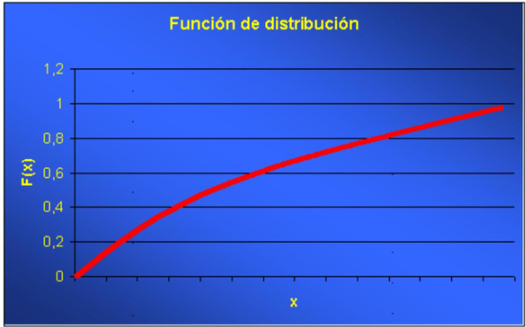
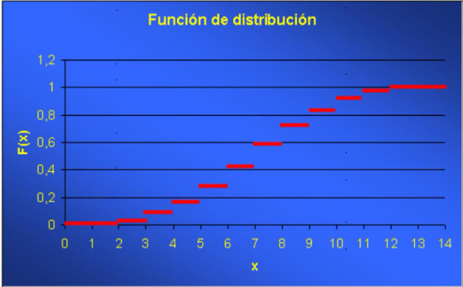
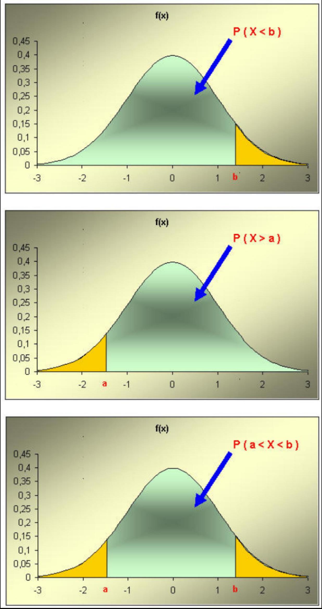
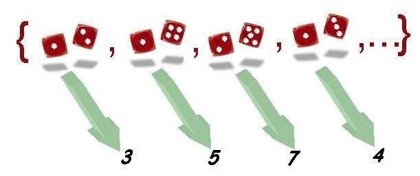
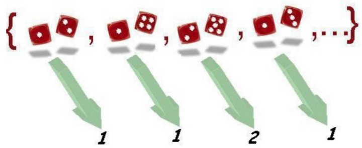
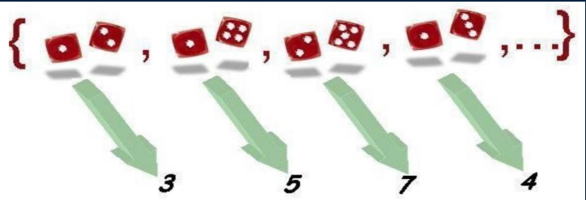
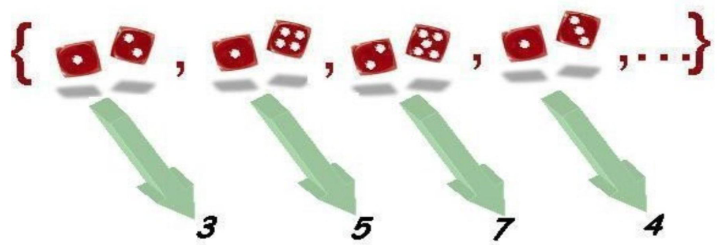
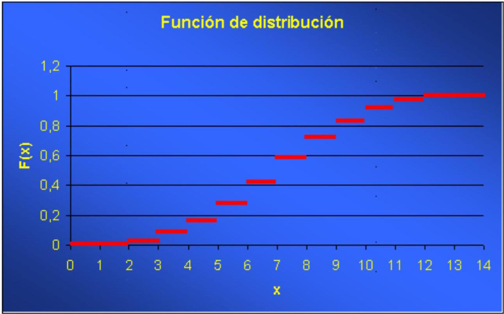
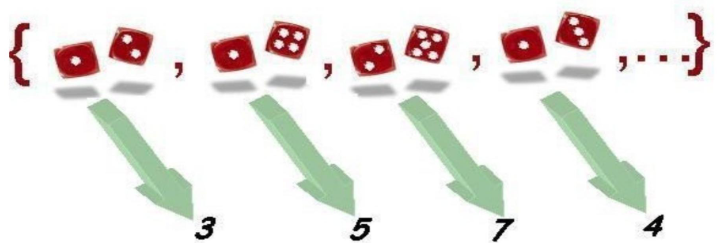
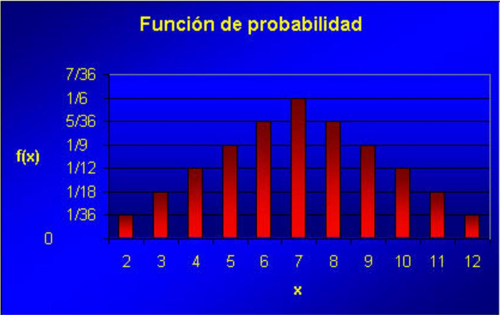

# Variables aleatorias y Distribuciones de probabilidad

En el capítulo anterior hemos introducido el concepto de probabilidad y
como calcular probabilidades asociadas a sucesos observables, formados
por uno o mas sucesos elementales, resultado de un experimento
aleatorio.

En muchas ocasiones nos interesa representar los resultados de un
experimento aleatorio mediante un valor numérico que lo caracterice. Por
ejemplo si tiramos tres monedas y contamos el número de caras, nos será
indiferente cuando salgan dos caras, en que monedas ha salido una cara y
en cual ha salido una cruz.

En la práctica, esto significa que en dichas ocasiones, aunque haya un
experimento aleatorio detras de los valores que observamos, tan sólo nos
interesan los resultados que expresamos a traves de valores numéricos.

Las variables aleatorias son la forma que hemos desarrollado para
*trasladar la estructura proporcionada por los espacios de probabilidad
el espacio muestral, el conjunto de sucesos elementales, al conjunto de
los números, en concreto a la recta real, haciéndolo de tal forma que
podamos seguir calculando probabilidades de sucesos observables*.

En este capítulo veremos que las variables aleatorias permiten pues
*transportar* la probabilidad del espacio de probabilidad original a la
recta real. Para ello, introduciremos una función que es la que se ocupa
de ello, la *función de distribución de probabilidad*.

## El espacio muestral y sus elementos

Cuando llevamos a cabo un experimento aleatorio, el conjunto $\Omega$ de
resultados posibles forman el denominado espacio muestral. Sus elementos
$\omega$ (resultados o sucesos elementales) deben ser conocidos por el
investigador que realiza la experiencia, aun cuando no podamos
determinar a priori el resultado particular de una realización concreta.

Supondremos que también conocemos la manera de asignar una probabilidad
sobre el conjunto de enunciados o *sucesos observables* que se pueden
construir a partir de $\Omega$. Es decir, supondremos la existencia de
un espacio de probabilidad construido a partir de los resultados de
$\Omega$.

Generalmente, la estructura del espacio muestral no permite, o por lo
menos no facilita, su tratamiento matemático. Pensemos en la inmensa
variedad en la naturaleza de resultados posibles de diferentes
experimentos. Además es bastante frecuente que no nos interesen los
resultados en sí, sino una característica que, de alguna manera, resuma
el resultado del experimento.

## Representación numérica de los sucesos elementales. Variables aleatorias

La forma de resumen que adoptaremos es la asignación a cada suceso
elemental de un valor numérico, en particular, de un número real.

En la práctica la asignación de un valor numérico a cada elemento del
espacio muestral se hace siguiendo una regla o enunciado, según el
interés concreto del experimentador. Evidentemente, podemos construir
diversas maneras de asignar valores numéricos a los mismos resultados de
un experimento.

Hablando en términos coloquiales, podemos decir que cada regla de
asignación corresponde a una determinada variable que se puede medir
sobre los sucesos elementales.

Nótese que es posible construir múltiples variables sobre un mismo
espacio de probabilidad. En términos algo más formales, las reglas de
asignación se pueden interpretar como una aplicación de $\Omega$ en el
conjunto de números reales. $$
\begin{aligned}
X: \Omega & \rightarrow \mathbb{R} \\
\omega & \rightarrow X(\omega)
\end{aligned}
$$

$X$ representa la variable o regla de asignación concreta. El conjunto
de valores numéricos que puede tomar una variable, y que depende de la
naturaleza de la misma variable, recibe el nombre de recorrido de la
variable.

A partir de este momento, los sucesos elementales quedan substituidos
por sus valores numéricos de acuerdo a una determinada variable y
permiten un mayor tratamiento matemático en el marco de la teoría de la
probabilidad.

El apelativo aleatoria que reciben las variables hace referencia al
hecho de que los posibles valores que toman dependen de los resultados
de un fenómeno aleatorio que se presentan con una determinada
probabilidad.

Como un complemento al tema, al final del capítulo, presentamos la
definición formal de variable aleatoria, donde se introducen las
restricciones a las reglas de asignación numérica que posibilitan el
tratamiento matemático de las variables.

## Caracterización de una variable aleatoria a través de la probabilidad. Función de distribución

Una vez que tenemos definida una variable aleatoria, ésta queda
totalmente caracterizada en el momento en que somos capaces de
determinar la probabilidad de que la variable tome valores en cualquier
intervalo de la recta real. Dado que los posibles valores que puede
tomar la variable, es decir, su recorrido, pueden ser muy grandes
(infinitos de hecho), el problema de caracterizar una variable aleatoria
se resuelve introduciendo una función especial, *la función de
distribución*.

::: definicion
**Definición**

La función de distribución de una variable aleatoria $X$ es la
aplicación que, a cada punto de la recta real, le asigna la probabilidad
del suceso formado por los resultados del experimento que tienen
asignado un valor de la variable aleatoria menor o igual a dicho punto.

$$
\begin{array}{rll}
F: & \mathbb{R} & \rightarrow[0,1] \\
& x & \rightarrow F(x)=P(X \leq x)=P\{\omega \in \Omega \mid X(\omega) \leq x\}
\end{array}
$$ También podemos decir que es la probabilidad inducida en el intervalo
de la recta $(-\infty, x]$
:::

Hay que hacer notar que siempre será posible determinar dicha
probabilidad gracias a los requerimientos exigidos en la definición
formal de variable aleatoria. Por tanto, toda variable aleatoria tiene
asociada una función de distribución. Nos referimos a esta función
cuando decimos que conocemos la distribución de la variable aleatoria.

## Propiedades de la función de distribución

La forma en que hemos definido las funciones de distribución determina que
dichas funciones deban de tener las siguientes propiedades:

1.  $0 \leq F(x) \leq 1. \quad$
Efectivamente, se trata de una probabilidad, por lo que toma valores entre 0 y 1

2.  $\lim _{x \rightarrow+\infty} F(x)=1. \quad$
A medida que un valor se hace más y más grande, la probabilidad de encontrar valores anteriores a él crece y, en el límite, valdrá uno (el valor máximo para una probabilidad).


3.  $\lim _{x \rightarrow-\infty} F(x)=0. \quad$
A medida que un valor se hace más y más negativo, la probabilidad de encontrar valores anteriores a él disminuye, y en el límite es cero (el valor mínimo para una probabilidad).

4.  $x_{1}<x_{2} \Rightarrow F\left(x_{1}\right) \leq F\left(x_{2}\right). \quad$
Por construcción, es una función monótona, es decir, si un valor es inferior a otro, la probabilidad de encontrar valores inferiores al menor de los dos será menor o igual que la de encontrarlos inferiores al mayor de los dos.

5.  $\lim _{x \rightarrow a^{+}} F(x)=F(a) \quad \forall a \in \mathbb{R}. \quad$
Por la forma en que se ha definido, la función de distribución es _contínua por la derecha_.

Toda función que verifique las propiedades anteriores es una función de
distribución y toda función de distribución caracteriza una determinada
variable aleatoria sobre algún espacio de probabilidad.

Las propiedades anteriores determinan la forma de la función de distribución. En concreto, según la variable sea contínua o discreta, conceptos definidos a continuación en el capítulo, la forma de la función será: :

Primer tipo (Variables contínuas)

```{r cdfContinuas, echo=FALSE, out.width="90%"}

```


Segundo tipo (variables discretas)


```{r cdfDiscretas, echo=FALSE, out.width="90%"}

```


<!-- Evidentemente, podrían aparecer distribuciones, y por tanto gráficas, -->
<!-- que combinen las características de los dos modelos anteriores. -->

## Clasificación de las variables aleatorias

Para su estudio, las variables aleatorias se clasifican en variables
discretas o variables contínuas.

### Variables aleatorias discretas

::::{.definicion}
**Definición: Variable aleatoria discreta**

Diremos que una variable aleatoria es discreta si su recorrido, es decir, el conjunto de valores que puede tomar, es finito
o infinito numerable. 
::::

Generalmente, este tipo de variables van asociadas
a experimentos en los cuales se cuenta el número de veces que se ha
presentado un suceso o donde el resultado es una puntuación concreta.

Los puntos del recorrido se corresponden con saltos en la gráfica de la
función de distribución, que correspondería al segundo tipo de gráfica
visto anteriormente.

### Variables aleatorias continuas

::::{.definicion}
**Definición: Variable aleatoria contínua**

Diremos que una variable aleatoria es continua si su función de distribución es una función
continua. 

También puede definirse, de forma análoga a las variables discretas como aquellas cuyo  recorrido, es decir, el conjunto de valores que puede tomar, es un intervalo o subconjunto no numerable de los números reales. En otras palabras, aquellas que pueden tomar cualquier valor dentro de un rango continuo, sin saltos entre los valores posibles.
::::

Se corresponde con el primer tipo de gráfica visto.

Generalmente, se corresponden con variables asociadas a experimentos en
los cuales la variable medida puede tomar cualquier valor en un
intervalo; mediciones biométricas, por ejemplo.

Un caso particular dentro de las variables aleatorias continuas y al
cual pertenecen todos los ejemplos usualmente utilizados, son las
denominadas variables aleatorias absolutamente continuas. 

::::{.definicion}
**Definición: Distribución absolutamente  contínua**

Diremos que una variable aleatoria $X$ continua tiene una distribución
absolutamente continua si existe una función real $f$, positiva e integrable en el conjunto de números reales, tal que la función de
distribución $F$ de $X$ se puede expresar como

$$
F(x)=\int_{-\infty}^{x} f(t) d t
$$
::::

Una variable aleatoria con distribución absolutamente continua, por
extensión, se la clasifica como variable aleatoria absolutamente
continua.


::::{.definicion}
**Definición: función de densidad de probabilidad**

A la función $f$ se la denomina función de densidad de probabilidad de
la variable $X$.
::::

Hay que hacer notar que no toda variable continua es absolutamente
continua, pero los ejemplos son complicados, algunos utilizan para su
construcción el conjunto de Cantor, y quedan fuera del nivel y del
objetivo de este curso.

Igualmente indicaremos que los tipos de variables comentados
anteriormente forman únicamente una parte de todos los posibles tipos de
variables, sin embargo contienen prácticamente todas las variables
aleatorias que encontramos usualmente.

Tal como se estudiará más adelante, existen algunas familias de
funciones de distribución, tanto dentro del grupo de las discretas como
de las continuas, que por su importancia reciben un nombre propio y se
estudiarán en los capítulos siguientes.

En ocasiones encontramos variables de tipo mixto, es decir que se
comportan como discretas o contínuas para distintos grupos de valores.

## Variable aleatoria discretas

Tal como se ha definido, una variable aleatoria $X$ discreta toma valores en un conjunrto finito o numerables. 

Indicaremos el recorrido de la variable $X$ como:
$\left\{x_{1}, x_{2}, \ldots, x_{\mathrm{k}}, \ldots\right\}$.

::::{.ejemplo}
El ejemplo más sencillo de variable aleatoria discreta lo constituyen
las variables indicadoras. Sea $A$ un suceso observable, se llama
indicador de $A$ a la variable aleatoria definida por

$$
\begin{aligned}
I_{A}: \Omega & \rightarrow \mathbb{R} \\
\omega & \rightarrow I_{A}(\omega)=\left\{\begin{array}{lll}
1 & \text { si } \omega \in A \\
0 & \text { si } & A
\end{array}\right.
\end{aligned}
$$

::::

#### Ejercicio propuesto

Construir, a partir de las variables indicadoras de $A$ y $B$, las
siguientes variables indicadoras

$$
I_{A \cap B} ; I_{A \cup B} ; I_{A} c ; I_{\Omega}
$$

##### Solución

$$
\begin{gathered}
I_{A \cap B}=I_{A} \cdot I_{B} \\
I_{A \cup B}=I_{A}+I_{B}-I_{A \cap B} \\
I_{A} c=1-I_{A} \\
\Omega=1
\end{gathered}
$$

### Caracterización de las v.a. discretas

Una variable aleatoria discreta puede caracterizarse a través de la
función que asocia cada elemento del recorrido su probabilidad.
Dicha función recibe varios nombres según los autores: 
- función de probabilidad
- ley de probabilidad, 
- función de densidad de la variable aleatoria
discreta.
- función de masa de probabilidad.

Aunque es habitual encontrar, en muchos libros el término _función de densidad_ para variables (absolutamente) contínuas y el término _función de masa de probabilidad_ para variables discretas, también lo es referirse a ambas como "función de densidad".

La función de probabilidad de una variable discreta se puede representar de la manera siguiente:

$$
\begin{array}{rll}
f: & \mathbb{R} & \rightarrow[0,1] \\
& x & \rightarrow f(x)=P(X=x)=P\{\omega \in \Omega \mid X(\omega)=x\}
\end{array}
$$

Obsérvese que, a diferencia de la función de distribución que toma valores para cualquier valor real, la función definida anteriormente es nula en todo punto que no
pertenezca al recorrido. 

En cambio, siguiendo con la análogía, y dado que se trata de una probabilidad, la
función de densidad discreta está acotada $0 \leq f(x) \leq 1$. 

Toda
función de densidad discreta puede expresarse de manera explícita a
través de una tabla que asocie directamente puntos del recorrido con sus
probabilidades.

::::{.ejemplo}
**Ejemplo: Función de densidad de una variable indicadora**

Consideremos la variable indicadora del suceso $A$ :

$$
\begin{aligned}
I_{A}: \Omega & \rightarrow \mathbb{R} \\
\omega & \rightarrow I_{A}(\omega)=\left\{\begin{array}{lll}
1 & \text { si } & \omega \in A \\
0 & \text { si } & A
\end{array}\right.
\end{aligned}
$$

La función de densidad de esta variable sería la siguiente:

|      $x$      |                   0                   |   1    |
|:-------------:|:-------------------------------------:|:------:|
| $f(x)=P(X=x)$ | $1-P(A)=P\left(A^{\mathrm{c}}\right)$ | $P(A)$ |

El recorrido está formado por dos valores: 1 y 0 , con las mismas
probabilidades que las del suceso $A$ y su complementario,
respectivamente.
::::

En muchos casos será posible expresar la función de probabilidadmediante una fórmula
matemática que define una regla de asignación de probabilidades para los
valores del recorrido.

::::{.ejemplo}
**Ejemplo: Un modelo matemático para la función de probabilidad**

$$
P(X=x)=0,2 \cdot 0,8^{x-1}, \quad x=1,2, \ldots
$$

es la función de densidad de una variable aleatoria discreta con
recorrido numerable.
::::

### Propiedades de la función de densidad discreta

1.  

$$
0 \leq f(x) \leq 1
$$

2.  $\sum_{i=1}^{n} f\left(x_{i}\right)=1$, si el recorrido es finito.
3.  $\sum_{i=1}^{\infty} f\left(x_{i}\right)=1$, si el recorrido es
    numerable.

### Relaciones entre la función de distribución y la función de densidad discreta. <br> Probabilidad de intervalos.

Existe una relación muy importante entre las funciones de distribución
$F(x)$ y de densidad $f(x)$ de una variable aleatoria discreta. La
función de distribución en un punto se obtiene acumulando el valor de la
función de densidad para todos los valores del recorrido menores o
iguales al punto en cuestión.

$$
F(x)=\sum_{x_{i} \leq x} f\left(x_{i}\right) \quad \text { para todo } \mathrm{x}_{\mathrm{i}} \text { perteneciente al recorrido de la variable. }
$$

En efecto, supongamos que el recorrido de una variable discreta $X$ es
$\left\{x_{1}, x_{2}, \ldots, x_{k}, \ldots\right\}$ y que deseamos
conocer el valor de la función de distribución en un punto $x$ tal que
$x_{i} \leq x<x_{i+1}$, entonces es inmediato que

$$
F(x)=P(X \leq x)=P\left(X=x_{1}\right)+P\left(X=x_{2}\right)+\ldots+P\left(X=x_{i}\right)=f\left(x_{1}\right)+f\left(x_{2}\right)+f\left(x_{3}\right)+\ldots+f\left(x_{i}\right)
$$

Por ejemplo, para una variable indicadora de un suceso $A$, tenemos la
relación siguiente:

| Valor de $\boldsymbol{x}$ | $\boldsymbol{f}(\boldsymbol{x})$ | $\boldsymbol{F}(\boldsymbol{x})$ |
|:----------------------:|:----------------------:|:----------------------:|
| $(-\infty, 0)$ |  | 0 |
| 0 | $P\left(A^{c}\right)$ | $P\left(A^{\mathrm{c}}\right)$ |
| $(0,1)$ |  | $P\left(A^{\mathrm{c}}\right)$ |
| 1 | $P(A)$ | $P\left(A^{\mathrm{c}}\right)+P(A)=1$ |
| $(1,+\infty)$ |  | 1 |

A partir de las funciones de densidad y de distribución es posible
expresar las probabilidades para cualquier posible intervalo de valores
de la variable. Por ejemplo:

| Intervalo                           |
|:------------------------------------|
| $P(X \leq a)=F(a)$                  |
| $P(X<a)=F(a)-f(a)$                  |
| $P(X>a)=1-F(a)=1-P(X \leq a)$       |
| $P(X \geq a)=1-F(a)+f(a)=1-P(X>a)$  |
| $P(a<X \leq b)=F(b)-F(a)$           |
| $P(a<X<b)=F(b)-f(b)-F(a)$           |
| $P(a \leq X \leq b)=F(b)-F(a)+f(a)$ |
| $P(a \leq X<b)=F(b)-f(b)-F(a)+f(a)$ |

## Variables aleatorias continuas

Una variable aleatoria $X$ diremos que es continua si su función de
distribución es una función continua. En la práctica, se corresponden
con variables asociadas con experimentos en los cuales la variable
medida puede tomar cualquier valor en un intervalo: mediciones
biométricas, intervalos de tiempo, áreas, etc.

::::{.ejemplo}
**Ejemplo: Variables aleatorias continuas**

-   Resultado de un generador de números aleatorios entre 0 y 1. Es el
    ejemplo más sencillo que podemos considerar, es un caso particular
    de una familia de variables aleatorias que tienen una distribución
    uniforme en un intervalo $[a, b]$. Se corresponde con la elección al
    azar de cualquier valor entre $a$ y $b$.
-   Estatura de una persona elegida al azar en una población. El valor
    que se obtenga será una medición en cualquier unidad de longitud ( m
    , cm , etc.) dentro de unos límites condicionados por la naturaleza
    de la variable. El resultado es impredecible con antelación, pero
    existen intervalos de valores más probables que otros debido a la
    distribución de alturas en la población. Más adelante veremos que,
    generalmente, variables biométricas como la altura se adaptan un
    modelo de distribución denominado distribución Normal y representado
    por una campana de Gauss.
::::

Dentro de las variables aleatorias continuas tenemos las variables
aleatorias absolutamente continuas.

Diremos que una variable aleatoria $X$ continua tiene una distribución
absolutamente continua si existe una función real $f$, positiva e
integrable en el conjunto de números reales, tal que la función de
distribución $F$ de $X$ se puede expresar como

$$
F(x)=\int_{-\infty}^{x} f(t) d t
$$

Una variable aleatoria con distribución absolutamente continua, por
extensión, se clasifica como variable aleatoria absolutamente continua.

En cuanto a nuestro manual, todas las variables aleatorias continuas con
las que trabajemos pertenecen al grupo de las variables absolutamente
continuas, en particular, los ejemplos y casos expuestos.

### Función de densidad continua

La función que caracteriza las variables continuas es aquella función
$f$ positiva e integrable en los reales, tal que acumulada desde
$-\infty$ hasta un punto $x$, nos proporciona el valor de la función de
distribución en $x, F(\mathrm{x})$. Recibe el nombre de función de
densidad de la variable aleatoria continua.

$$
F(x)=\int_{-\infty}^{x} f(t) d t
$$

Las funciones de densidad discreta y continua tienen, por tanto, un
significado análogo, ambas son las funciones que acumuladas (en forma de
sumatorio en el caso discreto o en forma de integral en el caso
continuo) dan como resultado la función de distribución.

La diferencia entre ambas, sin embargo, es notable.

-   La función de densidad discreta toma valores positivos únicamente en
    los puntos del recorrido y se interpreta como la probabilidad de la
    que la variable tome ese valor $f(x)=P(X=x)$.
-   La función de densidad continua toma valores en el conjunto de
    números reales y no se interpreta como una probabilidad. No está
    acotada por 1, puede tomar cualquier valor positivo. Es más, en una
    variable continua se cumple que probabilidades definidas sobre
    puntos concretos siempre son nulas.

$$
P(X=x)=0 \text { para todo } x \text { real. }
$$

¿Cómo se interpreta, entonces, la función de densidad continua? Las
probabilidades son las áreas bajo la función de densidad. El área bajo
la función de densidad entre dos puntos a y b se interpreta como la
probabilidad de que la variable aleatoria tome valores comprendidos
entre $a$ y $b$.

Por tanto, siempre se cumple lo siguiente:

$$
\int_{-\infty}^{+\infty} f(x) d x=1
$$

La función de densidad se expresa a través de una función matemática. La
forma específica de la función matemática generalmente pasa por
considerar a la variable aleatoria como miembro de una determinada
familia de distribuciones, un determinado modelo de probabilidad. Estas
familias generalmente dependen de uno o más parámetros y serán objeto de
un estudio específico en un capítulo posterior. La atribución a una
determinada familia depende de la naturaleza de la variable en cuestión.

Podemos ver, únicamente con ánimo ilustrativo, la expresión analítica y
la gráfica para los ejemplos comentados con anterioridad:

-   Resultado de un generador de números aleatorios entre
    $\boldsymbol{a}$ y $\boldsymbol{b}$. Modelo Uniforme.
    $f(x)=\left\{\begin{array}{cc}\frac{1}{b-a} & x \in[a, b] \\ 0 & x \notin[a, b]\end{array}\right\}$
-   Estatura de una persona elegida al azar en una población. Modelo
    Normal.

$$
f(x)=\frac{1}{\sqrt{2 \pi}} e^{\frac{-(x-170)^{2}}{2}}-\infty<x<\infty
$$

### Relaciones entre la función de distribución y la función de densidad.

Para una variable continua, la relación entre las funciones de
distribución y de densidad viene dada directamente a través de la
definición. La función de distribución en un punto se obtiene integrando
el valor de la función de densidad desde menos infinito hasta el punto
en cuestión. Por ejemplo:

$$
F(x)=\int_{-\infty}^{x} f(t) d t
$$

#### Probabilidad de intervalos

A partir de las funciones de densidad y de distribución, y teniendo en
cuenta que $P(X=x)=0$ para todo $x$ real, es posible expresar las
probabilidades para cualquier posible intervalo de valores de la
variable. Por ejemplo:

|                         Intervalo                         |
|:---------------------------------------------------------:|
|   $P(X \leq a)=P(X<a)=F(a)=\int_{-\infty}^{a} f(x) d x$   |
|  $P(X \geq a)=P(X>a)=1-F(a)=\int_{a}^{+\infty} f(x) d x$  |
| $P(a<X \leq b)=P(a<X<b)=P(a \leq X \leq b)=P(a \leq X<b)$ |
|              $=F(b)-F(a)=\int^{b} f(x) d x$               |

Fijémonos que la probabilidad de los intervalos se corresponde con el
área bajo la función de densidad dentro del intervalo considerado.

```{r, echo=FALSE, out.width="80%"}

```

<!--  -->

## Caracterización de una variable aleatoria a través de parámetros

Hasta el momento hemos visto que toda variable aleatoria viene
caracterizada a través de unas determinadas funciones matemáticas, las
funciones de distribución y de densidad. Una vez caracterizada, y por
tanto conocida, la distribución de una variable aleatoria, podemos
obtener cualquier probabilidad asociada.

En ocasiones podemos acotar más el problema y reducir el estudio de una
variable aleatoria a determinar una serie de características numéricas
asociadas con la distribución de la variable. Dichas características
tienen como propiedad fundamental el hecho de resumir gran parte de las
propiedades de la variable aleatoria y juegan un papel muy destacado en
las técnicas estadísticas que desarrollaremos a lo largo del curso.

Por ejemplo, supuesta la pertenencia de una variable aleatoria a una
determinada familia de distribuciones de probabilidad, bien sea discreta
o continua, los diferentes miembros de la familia diferirán en el valor
de esas características numéricas. En este caso, denominaremos a tales
características los parámetros de la distribución.

Existe un buen número de tales características, pero nos centraremos en
las dos más importantes: la esperanza y la varianza. La primera nos
informa sobre la localización de los valores de la variable y la
segunda, sobre el grado de dispersión de estos valores.

## Esperanza de una variable aleatoria discreta

La esperanza matemática de una variable aleatoria es una característica
numérica que proporciona una idea de la localización de la variable
aleatoria sobre la recta real. Decimos que es un parámetro de
centralización o de localización.

Su interpretación intuitiva o significado se corresponde con el valor
medio teórico de los posibles valores que pueda tomar la variable
aleatoria, o también con el centro de gravedad de los valores de la
variable supuesto que cada valor tuviera una masa proporcional a la
función de densidad en ellos.

La definición matemática de la esperanza en el caso de las variables
aleatorias discretas se corresponde directamente con las
interpretaciones proporcionadas en el párrafo anterior. Efectivamente,
supuesta una variable aleatoria discreta $X$ con recorrido
$\left\{x_{1}, x_{2}, \ldots, x_{k}, \ldots\right\}$ y con función de
densidad $f(x)$, se define la esperanza matemática de $X$ como el valor

$$
E(X)=\sum_{x_{i} \in X(\Omega)} x_{i} f\left(x_{i}\right)
$$

donde el sumatorio se efectúa para todo valor que pertenece al recorrido
de $X$. En caso de que el recorrido sea infinito la esperanza existe si
la serie resultante es absolutamente convergente, condición que no
siempre se cumple.

La definición se corresponde con un promedio ponderado según su
probabilidad de los valores del recorrido y, por tanto, se corresponde
con la idea de un valor medio teórico.

## Esperanza de una variable aleatoria continua

La idea intuitiva que más nos puede ayudar en la definición de la
esperanza matemática de una variable aleatoria continua es la idea del
centro de gravedad de los valores de la variable, donde cada valor tiene
una masa proporcional a la función de densidad en ellos.

Dada una variable aleatoria absolutamente continua $X$ con función de
densidad $f(x)$, se define la esperanza matemática de $X$ como el valor

$$
E(X)=\int_{-\infty}^{+\infty} x f(x) d x
$$

suponiendo que la integral exista.

## Propiedades de la esperanza matemática

1.  Esperanza de una función de una variable aleatoria

-   Variable discreta

$$
E(h(X))=\sum_{x_{i} \in X(\Omega)} h\left(x_{i}\right) f\left(x_{i}\right)
$$

-   Variable continua

$$
E(h(X))=\int_{-\infty}^{+\infty} h(x) f(x) d x
$$

### Linealidad de la esperanza matemática

-   $E(X+Y)=E(X)+E(Y)$
-   $E(k \cdot X)=k \cdot E(X)$ para todo número real $k$.
-   $E(k)=k$ para todo número real $k$.

- $E(a \cdot X+b)=a \cdot E(X)+b$ para todo par de números reales $a$ y
$b$.

### Esperanza del producto

-   $E(X \cdot Y)=E(X) \cdot E(Y)$ únicamente en el caso de que $X$ e
    $Y$ sean variables aleatorias independientes.

## Varianza de una variable aleatoria

La varianza de una variable aleatoria es una característica numérica que
proporciona una idea de la dispersión de la variable aleatoria respecto
de su esperanza. Decimos que es un parámetro de dispersión.

La definición es la siguiente:

$$
\operatorname{Var}(X)=E\left((X-E(X))^{2}\right)
$$

Es, por tanto, el promedio teórico de las desviaciones cuadráticas de
los diferentes valores que puede tomar la variable respecto de su valor
medio teórico o esperanza.

En el caso de las variables discretas, la expresión se convierte en:

$$
\operatorname{Var}(X)=\sum_{x_{i} \in X(\Omega)}\left(x_{i}-E(X)\right)^{2} f\left(x_{i}\right)
$$

mientras que para las variables continuas tenemos:

$$
\operatorname{Var}(X)=\int_{-\infty}^{+\infty}(x-E(X))^{2} f(x) d x
$$

En ambos casos existe una expresión equivalente alternativa y
generalmente de cálculo más fácil:

$$
\operatorname{Var}(X)=E\left(X^{2}\right)-(E(X))^{2}
$$

Una de las características de la varianza es que viene expresada en
unidades cuadráticas respecto de las unidades originales de la variable.
Un parámetro de dispersión derivado de la varianza y que tiene las
mismas unidades de la variable aleatoria es la desviación típica, que se
define como la raíz cuadrada de la varianza.

$$
\sigma_{X}=\sqrt{\operatorname{Var}(X)}=\sqrt{E\left((X-E(X))^{2}\right)}
$$

### Propiedades de la varianza

1.  $\operatorname{Var}(X) \geq 0$
2.  $\operatorname{Var}(k \cdot X)=k^{2} \cdot \operatorname{Var}(X)$
    para todo numero real $k$.
3.  $\operatorname{Var}(k)=0$ para todo numero real $k$.
4.  $\operatorname{Var}(a \cdot X+b)=a^{2} \cdot \operatorname{Var}(X)$
    para todo par de números reales $a$ i $b$.
5.  $\operatorname{Var}(X+Y)=\operatorname{Var}(X)+\operatorname{Var}(Y)$
    únicamente en el caso que $X$ y $Y$ sean independientes.

## Momentos (de orden $k$) de una variable aleatoria

-   Dada una variable aleatoria $X$, definimos el momento de orden $k$
    como:

$$
m_{k}=E\left(X^{k}\right)
$$

suponiendo que tal esperanza exista. Podemos ver que la esperanza es el
momento de orden $1, E(X)=m_{1}$.

-   Definimos el momento central de orden $k$ como:

$$
\mu_{k}=E\left((X-E(X))^{k}\right)
$$

Con la denominación anterior, la varianza es el momento central de orden
$2, \operatorname{Var}(X)=\mu_{2}$.

-   Es posible también definir momentos mixtos de dos variables
    aleatorias. Dadas dos variables aleatorias $X$ e $Y$ definimos el
    momento mixto de orden $(r, k)$ como

$$
m_{r k}=E\left(X^{r} \cdot Y^{k}\right)
$$

y el momento mixto central de orden $(r, k)$ como

$$
\left.\mu_{r k}=E(X-E(X))^{r} \cdot(Y-E(Y))^{k}\right)
$$

-   El momento mixto central más importante es el $\mu_{11}$, denominado
    la covarianza de $X$ e $Y$, y con una interpretación en el sentido
    de cuantificar el grado de dependencia entre dos variables
    aleatorias, puesto que si $X$ e $Y$ son independientes se verifica
    que $\mu_{11}=0$, mientras que si $\mu_{11} \neq 0$ entonces las
    variables son dependientes.

## Definición formal de variable aleatoria

Tal como hemos comentado, la definición formal de variable aleatoria
impone una restricción matemática en la formulación vista hasta el
momento.

Definiremos una variable aleatoria como una aplicación de $\Omega$ en el
conjunto de números reales

$$
\begin{aligned}
X: \Omega & \rightarrow \mathbb{R} \\
\omega & \rightarrow X(\omega)
\end{aligned}
$$ que verifique la propiedad siguiente

$$
\forall x \in \mathbb{R} \quad \text { el conjunto } \mathrm{A}=\{a \mid \mathrm{X}(a) \leq \mathrm{x}\} \text { es un suceso observable }
$$

es decir, para todo número real $x$, el conjunto de resultados
elementales tales que la variable aleatoria toma sobre ellos valores
inferiores o iguales a $x$ ha de ser un suceso sobre el cual podamos
definir una probabilidad.

Dicha propiedad recibe el nombre de medibilidad y por tanto podríamos
decir que una variable aleatoria es una función medible de $\Omega$ en
los reales.

Esta condición nos asegura que podremos calcular sin problemas,
probabilidades sobre intervalos de la recta real a partir de las
probabilidades de los sucesos correspondientes.

$$
P(X \leq x)=P\{\omega \mid X(\omega) \leq x\}
$$

La expresión anterior se leería de la manera siguiente: La probabilidad
de que la variable aleatoria tome valores inferiores o iguales a $x$ es
igual a la probabilidad del suceso formado por el conjunto de resultados
elementales sobre los que el valor de la variable es menor o igual que
$x$.

La probabilidad obtenida de esta manera se denomina probabilidad
inducida. Se puede comprobar que, a partir de la condición requerida, se
pueden obtener probabilidades sobre cualquier tipo de intervalo de la
recta real. Por ejemplo:

$$
P(a<X \leq b)=P(X \leq b)-P(X \leq a)
$$

La condición exigida para ser variable aleatoria discreta ahora puede
ser expresada como:

$$
\forall k=1,2, \ldots \text { el conjunto } \mathrm{A}=\left\{\omega \mid \mathrm{X}(\omega)=\mathrm{x}_{\mathrm{k}}\right\}=\mathrm{X}^{-1}\left(\left\{\mathrm{x}_{\mathrm{k}}\right\}\right) \text { es un suceso observable }
$$

Toda variable aleatoria definida sobre un espacio de probabilidad finito
es necesariamente discreta. La suma y el producto de variables
aleatorias discretas, definido por:

$$
(X+Y)(w)=X(w)+Y(w) \text { y }(X \cdot Y)(w)=X(w) \cdot Y(w)
$$

es también una variable aleatoria discreta.

## Caso práctico: Lanzamiento de dos dados

### Espacio muestral

Supongamos que estamos realizando un experimento consistente en el lanzamiento simultáneo de dos dados y en la observación del resultado
obtenido.

El conjunto de resultados posibles forma el espacio muestral $\Omega$ asociado a dicho experimento. Sus elementos serán como los que se
muestran a continuación:


En total, el espacio muestral estaría formado por 36 resultados posibles
que, en principio y suponiendo los dados regulares, son todos ellos
equiprobables con probabilidad $1 / 36$.

Nótese que consideramos diferentes resultados del tipo: un uno en el
primer dado y un dos en el segundo o un dos en el primer dado y un uno
en el segundo.

Una vez fijados los enunciados anteriores, es fácil asignar
probabilidades a diferentes sucesos observables, por ejemplo:

|              Suceso              |      Probabilidad       |
|:--------------------------------:|:-----------------------:|
| Que aparezcan dos cifras iguales | $6 \cdot 1 / 36=1 / 6$  |
|        Que la suma sea 10        | $3 \cdot 1 / 36=1 / 12$ |

No entramos en detalles de la obtención de las probabilidades dado que
se ha estudiado suficientemente en el tema anterior.

### Representación numérica

Continuando con el experimento anterior, podemos representar los
resultados obtenidos al lanzar dos dados por valores numéricos. ¿Cómo
hacerlo? Definiendo una regla de asignación numérica para cada
resultado.

Una posible regla sería, por ejemplo, asignar a cada resultado la suma
de puntos de las caras. Este enunciado nos define una variable que
representa cada suceso elemental por un valor numérico.



Los 36 posibles resultados del experimento se transforman en 11 posibles
valores numéricos para la variable: $2,3,4,5,6,7,8,9,10,11$ y 12 .

Este conjunto de valores forman el *recorrido de la variable suma de
puntos de las caras*. A partir de las probabilidades definidas sobre los
sucesos observables es fácil extender las probabilidades a los
diferentes resultados de la variable.

Por ejemplo, la probabilidad de que la variable tome el valor 10 es
equivalente a la probabilidad del suceso observable que la suma sea 10 ,
calculada anteriormente e igual a $1 / 12$.

La variable considerada hasta el momento es sólo una de las múltiples
variables que podríamos definir sobre el mismo experimento. Por ejemplo,
podemos estar interesados no en la suma de puntos sino en el punto más
bajo de cada tirada, de forma que podríamos construir una nueva variable
a partir del enunciado o regla de asignación asignar a cada resultado el
menor de los puntos de las dos caras. Tenemos una nueva variable sobre
el mismo espacio anterior.



El recorrido, en este caso, está formado por los valores: $1,2,3,4,5$ y
6 . Las dos variables estudiadas y otras muchas que se podrían definir
sobre este experimento son ejemplos absolutamente equivalentes desde el
punto de vista formal.

### Algunas probabilidades

En el ejemplo de los dados vamos a centrarnos en la variable aleatoria

$$
X=\text { Suma de puntos de las caras }
$$



El recorrido de la variable está formado por los números
$\{2,3,4,5,6,7,8,9,10,11$ i 12$\}$. Vamos a calcular algunas
probabilidades:

-   $P(X \leq 1)=P\{\varnothing\}=0$ (Ningún resultado tiene asignado un
    valor menor o igual a 1)
-   $P(X \leq 2)=P\{(1,1)\}=1/36$ (Sólo hay un caso al que se le asigne
    un valor inferior o igual a 2).
-   $P(X \leq 3.5)=P\{(1,1), (1,2), (2,1)\}=3/36$ (Tres resultados
    elementales tienen asignado un valor menor o igual a 3.5)

Ahora podéis intentar calcular por vosotros mismos algunas
probabilidades: (a) $P(X \leq 6)$ (b) $P(X \leq 8,2)$; (c)
$P(X \leq 12)$; (d) $P(X \leq 20)$ i (e) $P(2,2<X \leq 7)$

### Función de distribución

Para calcular la función de distribución de la variable X $=$ Suma de
puntos de las caras :



necesitamos conocer el recorrido de la variable, que es:
$\{2,3,4,5,6,7,8,9,10,11, 12\}$ y, utilizando este recorrido como pauta,
determinar *para todo punto* $x$ *de la recta real* la probabilidad
$P(X \leq x)$.

En nuestro ejemplo:

$$
F(x)=P(X \leq x)= \begin{cases}0 & x<2 \\ 1 / 36 & 2 \leq x<3 \\ 3 / 36 & 3 \leq x<4 \\ 6 / 36 & 4 \leq x<5 \\ 10 / 36 & 5 \leq x<6 \\ 15 / 36 & 6 \leq x<7 \\ 21 / 36 & 7 \leq x<8 \\ 26 / 36 & 8 \leq x<9 \\ 30 / 36 & 9 \leq x<10 \\ 33 / 36 & 10 \leq x<11 \\ 35 / 36 & 11 \leq x<12 \\ 36 / 36=1 & x \geq 12\end{cases}
$$

Acabamos de construir la función de distribución de la variable suma de
la puntuación al lanzar dos dados.

Vamos a ver su representación gráfica:

```{r, cdfSumaDados, out.width="90%", echo=FALSE}

```


Ejercicio : Haced lo mismo para la variable aleatoria el menor de los
puntos de las dos caras al lanzar dos dados.

### Clasificación de las variables

En el experimento que estamos considerando, lanzar simultáneamente dos
dados, cualquiera de las dos variables aleatorias que hemos considerado
hasta el momento:

$$ X=\text {Suma los puntos de las dos caras } $$

$$
Y=\text { El menor de los puntos de las dos caras }
$$

se clasifican dentro del tipo de variables aleatorias discretas, puesto
que en ambos casos el recorrido es finito:
$\{2,3,4,5,6,7,8,9,10,11, 12\}$ para la variable $X$ y
$\{1,2,3,4,5, 6\}$ para la variable $Y$.

También son discretas aquellas variables aleatorias con recorrido
infinito numerable.

Ejercicio: ¿Sabríais construir una variable aleatoria discreta con
recorrido infinito numerable basada en el experimento que consiste en el
lanzamiento de dos dados?

### Función de densidad discreta

Para calcular la función de densidad de la variable

$$
X=\text { suma de puntos de las caras }
$$



necesitamos conocer el recorrido de la variable, es decir:
$\{2,3,4,5,6,7,8,9,10,11, 12\}$ y, a partir del recorrido, determinar
para todo punto del recorrido la probabilidad $P(X=x)$.

En nuestro ejemplo

$$
f(x)=P(X=x)= \begin{cases}1 / 36 & x=2 \\ 2 / 36 & x=3 \\ 3 / 36 & x=4 \\ 4 / 36 & x=5 \\ 5 / 36 & x=6 \\ 6 / 36 & x=7 \\ 5 / 36 & x=8 \\ 4 / 36 & x=9 \\ 3 / 36 & x=10 \\ 2 / 36 & x=11 \\ 1 / 36 & x=12\end{cases}
$$

Acabamos de construir la función de densidad de la variable suma de la
puntuación al lanzar dos dados.

Vamos a ver su representación gráfica:

```{r, echo=FALSE, out.width="80%"}

```


<!--  -->

Hemos optado por la representación con barras en lugar de puntos para
permitir una visualización de la función óptima.

Ejercicio: Haced lo mismo para la variable aleatoria el menor de los
puntos de las dos caras al lanzar dos dados.

### Probabilidad de intervalos

Vamos a centrarnos en la variable

$$
X=\text { Suma de puntos de las caras }
$$

Las funciones de distribución y de densidad son, respectivamente,

$$
F(x)=P(X \leq x)=\left\{\begin{array}{ll}
0 & x<2 \\
1 / 36 & 2 \leq x<3 \\
3 / 36 & 3 \leq x<4 \\
6 / 36 & 4 \leq x<5 \\
10 / 36 & 5 \leq x<6 \\
15 / 36 & 6 \leq x<7 \\
21 / 36 & 7 \leq x<8 \\
26 / 36 & 8 \leq x<9 \\
30 / 36 & 9 \leq x<10 \\
33 / 36 & 10 \leq x<11 \\
35 / 36 & 11 \leq x<12 \\
36 / 36=1 & x \geq 12
\end{array} \quad f(x)=P(X=x)= \begin{cases}1 / 36 & x=2 \\
2 / 36 & x=3 \\
3 / 36 & x=4 \\
4 / 36 & x=5 \\
5 / 36 & x=6 \\
6 / 36 & x=7 \\
5 / 36 & x=8 \\
4 / 36 & x=9 \\
3 / 36 & x=10 \\
2 / 36 & x=11 \\
1 / 36 & x=12\end{cases}\right.
$$

Puede observarse cómo los valores de la función de distribución se
obtienen acumulando los valores de la función de densidad
correspondientes.

Vamos a calcular algunas probabilidades utilizando las funciones
anteriores. Compárese con los resultados obtenidos con anterioridad
basados directamente en los resultados elementales.

-   $P(X \leq 1)=F(1)=0$
-   $P(X \leq 3,5)=F(3,5)=3 / 36=f(2)+f(3)$
-   $P(X<6)=F(6)-f(6)=15 / 36-5 / 36=10 / 36=f(2)+f(3)+f(4)+f(5)$
-   $P(2,2<X \leq 7)=F(7)-F(2,2)=21 / 36-1 / 36=20 / 36=f(3)+f(4)+f(5)+f(6)+f(7)$
-   $P(2<X<7)=F(7)-f(7)-F(2)=21 / 36-6 / 36-1 / 36=14 / 36=f(3)+f(4)+f(5)+f(6)$

### Esperanza

Supongamos que estamos interesados en determinar cual sería el valor
medio teórico de la variable

$$
X=\text { Suma de puntos de las caras }
$$

La función de densidad es:

$$
f(x)=P(X=x)= \begin{cases}1 / 36 & x=2 \\ 2 / 36 & x=3 \\ 3 / 36 & x=4 \\ 4 / 36 & x=5 \\ 5 / 36 & x=6 \\ 6 / 36 & x=7 \\ 5 / 36 & x=8 \\ 4 / 36 & x=9 \\ 3 / 36 & x=10 \\ 2 / 36 & x=11 \\ 1 / 36 & x=12\end{cases}
$$

La misma función de densidad nos da información sobre el recorrido de la
variable. Calcular el valor medio teórico de la variable quiere decir
calcular la esperanza. A partir de la fórmula de la esperanza para
variables discretas, tenemos

$$
\begin{aligned}
E(X) &=2 \cdot 1 / 36+3 \cdot 2 / 36+4 \cdot 3 / 36+5 \cdot 4 / 36+6 \cdot 5 / 36+\\
& + 7 \cdot 6 / 36+8 \cdot 5 / 36+9 \cdot 4 / 36+\\
&+ 10 \cdot 3 / 36+ 
11 \cdot 2 / 36+12 \cdot 1 / 36=\\
& =7
\end{aligned}
$$

Por tanto, 7 es la esperanza de la variable $X=$ Suma de puntos de las
caras. Fijaos que la esperanza para la variable Puntuación de un dado
sería

$$
1 \cdot 1 / 6+2 \cdot 1 / 6+3 \cdot 1 / 6+4 \cdot 1 / 6+5 \cdot 1 / 6+6 \cdot 1 / 6=3,5
$$

y que se puede considerar la variable Suma de puntos de las dos caras
como la suma de dos variables que representen la puntuación de cada
dado. La esperanza de la suma es, efectivamente, la suma de las
esperanzas de cada variable sumada.

En la aplicación siguiente, podéis calcular la esperanza de la variable
Puntuación de un dado y modificar las probabilidades de las diferentes
caras, de este modo se modifica la esperanza.

Ejercicio: ¿Podríais hacer lo mismo para la variable $X=$ El menor de
los puntos de las dos caras al lanzar dos dados?

### Esperanza de un juego

Imaginemos que alguien os propone el juego siguiente: lanzad dos dados,
si la suma obtenida es menor o igual a 6 ganáis 100 euros, sin embargo,
si la suma obtenida es mayor que 6 tenéis que pagar 100 euros. ¿Nos
conviene jugar a este juego?

Veamos, podemos considerar el resultado del juego como una variable
aleatoria discreta que toma dos valores: +100 si ganamos y -100 si
perdemos. Nos interesa conocer las probabilidades de los diferentes
resultados. Consideremos la variable $X=$ Suma de puntos de las caras,
cuya función de densidad conocemos:

$$
f(x)=P(X=x)= \begin{cases}1 / 36 & x=2 \\ 2 / 36 & x=3 \\ 3 / 36 & x=4 \\ 4 / 36 & x=5 \\ 5 / 36 & x=6 \\ 6 / 36 & x=7 \\ 5 / 36 & x=8 \\ 4 / 36 & x=9 \\ 3 / 36 & x=10 \\ 2 / 36 & x=11 \\ 1 / 36 & x=12\end{cases}
$$

A partir de aquí es fácil ver que la función de densidad de la variable
$Y=$ Resultado del juego será la siguiente:

$$
f(100)=15 / 36 ; f(-100)=21 / 36
$$

Por tanto, la esperanza del juego, que puede ser interpretada como la
ganancia media por jugada, será

$$
E(Y)=100 \cdot 15 / 36-100 \cdot 21 / 36=-100 / 6 \approx-16,667
$$

Es decir, la ganancia media por jugada es negativa, por tanto no es
favorable dicho juego para el jugador, es un juego no equitativo.

### Esperanza con recorrido infinito

Vamos a tratar de calcular la esperanza de la siguiente variable
aleatoria: $X=$ Número de lanzamientos que hemos de hacer para conseguir
que aparezca un doble seis La variable que acabamos de definir es una
variable discreta con recorrido infinito numerable. El recorrido sería
el siguiente:

$$
\{1,2,3,4, \ldots\}
$$

Vamos a ver como calculamos la función de densidad: $P(X=1)=$
Probabilidad de que aparezca un doble seis en el primer lanzamiento
$=1 / 36$ $P(X=2)=$ Probabilidad de que el doble seis no aparezca en el
primer lanzamiento y sí en el segundo =
$35 / 36 \cdot 1 / 36=35 / 36^{2}$ $P(X=3)=$ Probabilidad de que el
doble seis no aparezca ni en el primer ni en el segundo lanzamientos y
sí en el tercero $=35 / 36 \cdot 35 / 361 / 36=35^{2} / 36^{3}$

En general, $P(X=k)=35^{k-1} / 36^{k}$ Para simplificar, vamos a llamar
$p=1 / 36$ y $q=1-p=35 / 36$, con esta nomenclatura
$P(X=\mathrm{k})=q^{k-1} p$. Por tanto, la esperanza será:

$$
\begin{aligned}
E(X)& =\sum_{i=1}^{\infty} i q^{i-1} p=p \sum_{i=1}^{\infty} i q^{i-1}=p \frac{d}{d q} \sum_{i=1}^{\infty} q^{i}= \\ 
&= p \frac{d}{d q}\left(\frac{q}{1-q}\right)=p \frac{1}{(1-q)^{2}}=\\
& = \frac{1}{p}
\end{aligned}
$$

En nuestro ejemplo el número medio de tiradas antes de salir un doble
seis será 36 .

### Esperanza infinita

Ahora calcularemos la esperanza del juego siguiente: lanzamos un dado
hasta que aparece un número par, el jugador gana $2^{n}$ unidades
monetarias si aparece un número par por primera vez en la tirada nésima.

El recorrido de la variable aleatoria $X=$ Ganancia del juego, está
formado por todos los números de la forma $2^{n}$ con $n=1,2,3, \ldots$
La probabilidad de cada valor del recorrido es la probabilidad de que
aparezca un número par por primera vez en la tirada nésima, es decir
$(1 / 2)^{n-1} \cdot(1 / 2)=(1 / 2)^{n}$. Por tanto, la esperanza del
juego es la siguiente:

$$
E(X)=\sum_{n=1}^{\infty} 2^{n}(1 / 2)^{n}=\sum_{n=1}^{\infty} 1=\infty
$$

Como vemos, la variable aleatoria $X$ no tiene esperanza finita. El
enunciado presentado es una versión del problema presentado alrededor de
1730 por el matemático Daniel Bernouilli a la Academia de San
Petersburgo y conocido como la paradoja de San Petersburgo, dado que la
esperanza del juego es aparentemente infinita.

### Varianza

Si ahora queremos calcular la varianza de la variable

$$
X=\text { Suma de puntos de las caras }
$$

con función de densidad:

$$
f(x)=P(X=x)= \begin{cases}1 / 36 & x=2 \\ 2 / 36 & x=3 \\ 3 / 36 & x=4 \\ 4 / 36 & x=5 \\ 5 / 36 & x=6 \\ 6 / 36 & x=7 \\ 5 / 36 & x=8 \\ 4 / 36 & x=9 \\ 3 / 36 & x=10 \\ 2 / 36 & x=11 \\ 1 / 36 & x=12\end{cases}
$$

Podemos aplicar la fórmula

$$
\operatorname{Var}(X)=E\left(X^{2}\right)-(E(X))^{2}
$$

La esperanza ya la tenemos calculada con anterioridad

$$
\begin{aligned}
E(X) & =2 \cdot 1 / 36+3 \cdot 2 / 36+4 \cdot 3 / 36+5 \cdot 4 / 36+\\
& +6 \cdot 5 / 36+7 \cdot 6 / 36+8 \cdot 5 / 36+9 \cdot 4 / 36+\\
& +10 \cdot 3 / 36+ 11 \cdot 2 / 36+12 \cdot 1 / 36=\\
& =7
\end{aligned}
$$

Necesitamos calcular la esperanza de la variable al cuadrado, que en
este caso resulta:

$$
\begin{aligned}
E\left(X^{2}\right)& =2^{2} \cdot 1 / 36+3^{2} \cdot 2 / 36+4^{2} \cdot 3 / 36+5^{2} \cdot 4 / 36+6^{2} \cdot 5 / 36+\\
& + 7^{2} \cdot 6 / 36+8^{2} \cdot 5 / 36+9^{2} \cdot 4 / 36+  10^{2} \cdot 3 / 36+\\
& + 11^{2} \cdot 2 / 36+12^{2} \cdot 1 / 36=329 / 6 \\
&\approx 54,833
\end{aligned}
$$

Con lo que la varianza resulta ser

$$
\operatorname{Var}(X)=329 / 6-7^{2}=35 / 6 \approx 5,833
$$

Nuevamente, para la variable Puntuación de un dado, la varianza se
obtendría de la manera siguiente:

$$
\begin{aligned}
E(X)& =1 \cdot 1 / 6+2 \cdot 1 / 6+3 \cdot 1 / 6+4 \cdot 1 / 6+5 \cdot 1 / 6+6 \cdot 1 / 6= \\& =3,5\\
E \left(X^{2}\right)&=1^{2} \cdot 1 / 6+2^{2} \cdot 1 / 6+3^{2} \cdot 1 / 6+4^{2} \cdot 1 / 6+\\
& + 5^{2} \cdot 1 / 6+6^{2} \cdot 1 / 6=91 / 6\\ &  \approx 15,167 \\
\operatorname{Var}(X)&=91 / 6-3,5^{2}=35 / 12 \approx 2,9167
\end{aligned}
$$

y se cumple que la varianza de la variable Suma de puntos de las dos
caras es la suma de las varianzas de las puntuaciones de cada dado por separado. Recordemos que esto sólo sucede si las variables sumadas son independientes, como así ocurre con las puntuaciones de cada dado por separado.
