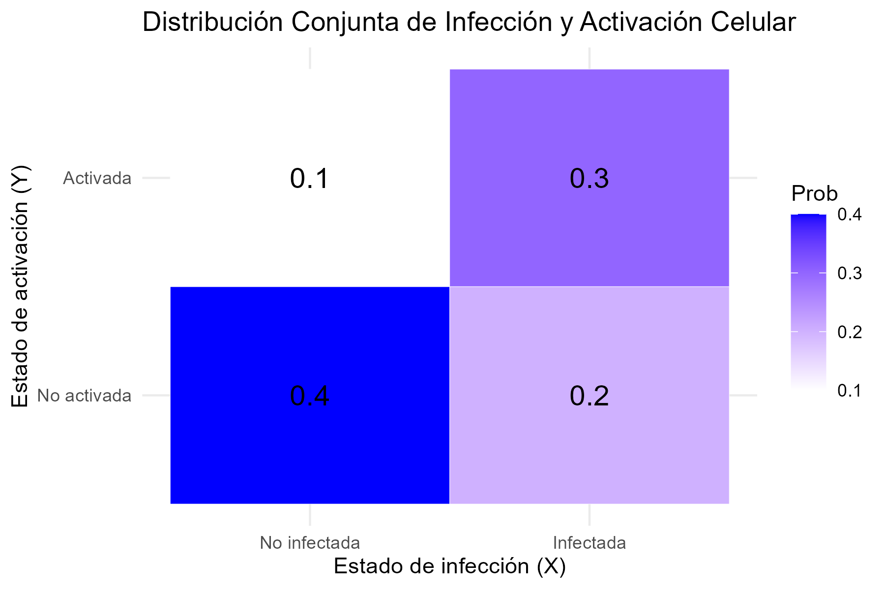

# Distribuciones de probabilidad multidimensionales

<!-- :::: {.calloutBox .important} -->

<!-- Este capítulo está en curso de ser introducido en los apuntes. -->

<!-- La versión actualizada estará disponible en el momento de inicio de la actividad, durante el semestre actual (2024-25-S1). -->

<!-- :::: -->

En este capítulo se extiende el concepto de variable aleatoria a un conjunto de variables que pueden interpretarse asociadas a un conjunto de medidas distintas y que pueden estar, o no relacionadas. 

Tras introducir los conceptos de distribuciones multidimensionales, condicionales y marginales, se pasa a considerar el caso más habitual en inferencia estadística en el que las componentes de los vectrores son independientes entre ellas.

Este es, de hecho, el punto de partida de muchos modelos y métodos en estadística.

## Distribuciones conjuntas de probabilidades

- A menudo nos interesa estudiar múltiples características de un fenómeno aleatorio:

  - La altura, el peso y el sexo de un individuo.
  - La expresión coordinada de los genes que participan en una determinada via metabólica.
  - El número de nucleótidos A, C, G, T en una región del genoma de tamaño $n$.

- Estas características numéricas que, de forma análoga al caso univariante, podemos suponer asociadas a los resultados de experimentos aleatorios se denominan *variables aleatorias multidimensionales* o, atendiendo a sus componentes, **vectores aleatorios**. 

Las distribuciones de probabilidad que, siguiendo con la analogía, asociaremos a los vectores aleatorios se denominan **distribuciones de probabilidades conjuntas** o **multivariantes**.

Antes de desarrollar el tema es importante remarcar que consideraremos dos escenarios:

- El primero, el "natural" es considerar que si trabajamos con distintas variables asociadas a un mismo fenómeno, es razonable suponer que varien de alguna forma coordinada. De ahí la expresión _distribución conjnta_.

- En ocasiones, sin embargo, dispondremos de vectores aleatorios que varian independientemente los unos de los otros. En este caso su distribución conjunta será de un tipo especial que se conoce _independencia_.

### Variable aleatoria bivariante

Empezaremos por el caso más sencillo que, sin embargo permite estudiar la mayoría de los conceptos quenos interesas: Las distribuciones conjuntas de dos variables aleatorias.

Una **variable aleatoria bivariante** es una aplicación que, a cada resultado de un experimento, le asocia dos números:

$$
(X, Y): \Omega \to \mathbb{R}^2
$$

$$
w \mapsto (X(w), Y(w))
$$

De modo que, para todo par de valores numéricos, $(x, y) \in \mathbb{R}^2$, se tiene

$$
\{w \in \Omega \mid X(w) \leq x,\quad Y(w) \leq y\} \in \mathcal{A}
$$
donde $\mathcal{A}$ representa el conjunto de _sucesos observables_ definido en el capítulo 1. 

Lo que viene a significar esta definición es que una variable aleatoria bidimensional es un conjunto de medidas (números reales) a los que, por el ehecho de poderse asociar con sucesos observables a traves de los intérvalos $X(w) \leq x,\quad Y(w) \leq y$ se les puede asociar (calcular) una probabilidad.

Fijémonos también que, como en el caso univariante, la función que _transporta_ la probabilidad, del espació de probabilidad al conjunto de los reales, será la función de distribución, que se define a continuación.

### Función de distribución bivariante

La función de distribución  conjunta de $X$ y $Y$, $F$, es una generalización inmediata del caso univariado y se define como:

$$
F(x, y) = P\{w \in \Omega \mid X(w) \leq x, Y(w) \leq y\} = P[X \leq x, Y \leq y]
$$

Como en el caso univariante, esta es la función que define la forma en que podemos calcular probabilidades sobre los valores de las variables, en este caso de dimensión 2.

::::{.ejemplo}

### Ejemplo: Distribución conjunta del estado de infección y activación de células

Supongamos que estamos observando dos características de células en un experimento de inmunología. Las variables que describen las células son:

- \( X \): La célula está infectada (\( X = 1 \)) o no infectada (\( X = 0 \)).
- \( Y \): La célula está activada (\( Y = 1 \)) o no activada (\( Y = 0 \)).

La siguiente tabla muestra la probabilidad conjunta de observar cada combinación de infección y activación en una célula:

| \( X \backslash Y \) | \( Y = 0 \) (No activada) | \( Y = 1 \) (Activada) |
|----------------------|---------------------------|-------------------------|
| \( X = 0 \) (No infectada)  | 0.4                       | 0.2                     |
| \( X = 1 \) (Infectada)     | 0.1                       | 0.3                     |

#### 1. Función de distribución conjunta

La función de distribución conjunta \( F(x, y) \) para esta situación se calcula como:

$$
F(x, y) = P(X \leq x, Y \leq y)
$$

Los valores para los pares posibles de \( x \) y \( y \) son:

- \( F(0, 0) = P(X = 0, Y = 0) = 0.4 \)
- \( F(0, 1) = P(X = 0, Y \leq 1) = P(X = 0, Y = 0) + P(X = 0, Y = 1) = 0.4 + 0.2 = 0.6 \)
- \( F(1, 0) = P(X \leq 1, Y = 0) = P(X = 0, Y = 0) + P(X = 1, Y = 0) = 0.4 + 0.1 = 0.5 \)
- \( F(1, 1) = P(X \leq 1, Y \leq 1) = 1 \)

#### 2. Cálculo de la probabilidad de eventos específicos

Por ejemplo, la probabilidad de que una célula esté infectada pero no activada es:

$$
P(X = 1, Y = 0) = 0.1
$$

### Implementación en R

Podemos visualizar esta distribución conjunta con un gráfico en R.

```{r,  echo=TRUE, collapse=TRUE}
library(ggplot2)

# Crear los datos de la distribución conjunta
data <- expand.grid(X = c(0, 1), Y = c(0, 1))
data$Prob <- c(0.4, 0.2, 0.1, 0.3)

# Crear el gráfico
p <- ggplot(data, aes(x = factor(X, labels = c("No infectada", "Infectada")),
                      y = factor(Y, labels = c("No activada", "Activada")))) +
  geom_tile(aes(fill = Prob), color = "white") +
  scale_fill_gradient(low = "white", high = "blue") +
  geom_text(aes(label = round(Prob, 2)), size = 5) +
  labs(x = "Estado de infección (X)", y = "Estado de activación (Y)", 
       title = "Distribución Conjunta de Infección y Activación Celular") +
  theme_minimal()

# Guardar el gráfico en el subdirectorio imagenes
ggsave("images/distribucion_conjunta.png", plot = p, width = 6, height = 4, dpi = 300)
```

```{r, out.width="80%"}

```


::::


## Variable aleatorias bivariantes discretas

Una vez introducidos los conceptos de forma general pasamos a estudiar el problema en el caso discreto, que es muy intuitivo y, a la vez permite introducir todos los conceptos relevantes. 

::::{.definicion}
Un **vector aleatorio discreto**, $(X, Y)$ es aquel cuyo recorrido o conjunto de valores posibles es finito o numerable.
::::

En este caso, toda probabilidad

$$
P\{(X, Y) \in B\}, \quad \text{donde } B \text{ es un conjunto de posibles valores de } X, Y,
$$

se puede calcular a partir de la **función de masa de probabilidad discreta bivariante**.

### Función de masa de probabilidad discreta (fmp)

La funcion de masa de probabilidad de los vectores aleatorios generaliza la función del mismo nombre en el caso univariante, es decir, es una función:

$$
f: \mathbb{R}^2 \to [0, 1]
$$

Que asigna la probabilidad a cada punto del plano: para todo $(x, y) \in \mathbb{R}^{2}$:

$$
f(x, y) = P\{w \in \Omega \mid X(w) = x, Y(w) = y\} = P[X = x, Y = y]
$$


### Propiedades de la fmp bivariante

- La masa total de probabilidad sobre el plano es 1:

$$
\sum_{(x_i, y_j) \in \mathbb{R}^{2}} f(x_i, y_j) = 1
$$

- Para todo subconjunto $B \subseteq \mathbb{R}^2$, se verifica:

$$
F(x, y) = P[X \leq x, Y \leq y] = \sum_{x_i \leq x, y_j \leq y} f(x_i, y_j)
$$

Es decir, como en el caso univariante _la función de distribución se puede calcular a partir de la función de masa de probabilidad_.

#### Intuición frente a construcción

La presentación de los conceptos anteriores suele generar cierto desasosiego entre los estudiantes que afrontan estos conceptos por primera (o siguientes) vez.

El motivo de este desasosiego es que el papel de la función de distribución no suele ser tan intuitivo como el de la función de masa de probabilidad. 

Es decir, es más intuitivo pensar en como calcular lña probabilidad que la variable tome un valor concreto ($P[X=x]$) , que la probabilidad de que no alcance cierto valor ($P[X\leq x]$).

Sin embargo, la función que realmente permite transportar la probabilidad no es la función de masa de probabilidad (fmp) sino la función de distribución (fdd). De ahí el contraste entre intuición (fmp) y construcción (fdd) 

### Ejemplo de distribución bivariante discreta

::::{.ejemplo}
Supongamos que un estudio mide el número de células infectadas y el número de  linfocitos activados en un campo microscópico. Dado el tamaño del campo y el grado de infección los valores observados de cada variables son:


- $X$: Número de células infectadas ($X \in \{0, 1, 2, 3, 4, 5\}$)).
- $Y$: Número de linfocitos activados ($Y \in \{0, 1, 2, 3\}$)).

La distribución conjunta se refleja en la siguiente tabla de probabilidades conjuntas:

| $P[X=x]$ | $P[Y = 0]$ | $P[Y = 1]$ | $P[Y = 2]$ | $P[Y = 3]$ |
|:-----:|:---------:|:---------:|:---------:|:---------:|
| 0     | 0.12      | 0.06      | 0.02      | 0.00      |
| 1     | 0.10      | 0.10      | 0.04      | 0.01      |
| 2     | 0.06      | 0.12      | 0.08      | 0.02      |
| 3     | 0.03      | 0.12      | 0.10      | 0.05      |
| 4     | 0.01      | 0.08      | 0.12      | 0.06      |
| 5     | 0.00      | 0.03      | 0.10      | 0.07      |

Puede comprobarse como la suma de todos los valores de la tabla es 1, y calcular probabilidades de sucesos como

**Probabilidad de que hayan dos células infectadas y un linfocito:**

Para calcular la probabilidad de que haya exactamente 2 células infectadas y 1 linfocito activado, se puede usar el valor directamente de la tabla.

$$
P(X = 2, Y = 1) = 0.12
$$

**Probabilidad de que hayan menos de tres celulas infectadas y menos de dos linfocitos:**

Esta probabilidad es la suma de todas las combinaciones de $X$ y $Y$) que cumplen con la condición de $X < 3$) y $Y < 2$). Es decir, sumamos las probabilidades de los casos 

$(X = 0, Y = 0)$), $(X = 0, Y = 1)$), $(X = 1, Y = 0)$), $(X = 1, Y = 1)$), $(X = 2, Y = 0)$), y $(X = 2, Y = 1)$).

$$
P(X < 3, Y < 2) = P(X = 0, Y = 0) + P(X = 0, Y = 1) + P(X = 1, Y = 0) + P(X = 1, Y = 1) + P(X = 2, Y = 0) + P(X = 2, Y = 1)
$$

$$
P(X < 3, Y < 2) = 0.12 + 0.06 + 0.10 + 0.10 + 0.06 + 0.12 = 0.56
$$

Recordemos que, al tratarse de variables discretas, no es lo mismo $P[X < x]$ que $P[X \leq x]$, por lo que si la pregunta fuera "Probabilidad de que hayan al menos  tres celulas infectadas y al menos dos linfocitos" deberíamos calcular:

$$
P(X \leq 3, Y \leq 2) 
$$
Esta última expresión se corresponde con la función de distribución evaluada en $(3,2)$.
::::

#### Código R para el cálculo de la pmf

Podemos hacer los cálculos usando R: 

```{r}
prob_table <- matrix(c(0.12, 0.06, 0.02, 0.00,
                       0.10, 0.10, 0.04, 0.01,
                       0.06, 0.12, 0.08, 0.02,
                       0.03, 0.12, 0.10, 0.05,
                       0.01, 0.08, 0.12, 0.06,
                       0.00, 0.03, 0.10, 0.07), 
                     nrow = 6, byrow = TRUE)

# Asignar nombres a las filas y columnas
rownames(prob_table) <- 0:5
colnames(prob_table) <- 0:3

# Mostrar la tabla

prob_table

# Calcular la probabilidad de (X = 2, Y = 1)
prob_X2_Y1 <- prob_table["2", "1"]
cat("P(X = 2, Y = 1) =", prob_X2_Y1, "\n")

# Calcular la probabilidad de (X < 3, Y < 2)
prob_X_lt_3_Y_lt_2 <- sum(prob_table[1:3, 1:2])
cat("P(X < 3, Y < 2) =", prob_X_lt_3_Y_lt_2, "\n")
```


#### Código R para visualizar la distribución conjunta

Para visualizar la distribución conjunta, podemos usar el código siguiente;


```{r plotTrinomial, out.width="90%"}
# Es preciso instalar y cargar el paquete scatterplot3d si no lo tienes instalado
# install.packages("scatterplot3d")
library(scatterplot3d)

# Crear una matriz con los datos de la tabla de probabilidades
X_vals <- as.numeric(rownames(prob_table))
Y_vals <- as.numeric(colnames(prob_table))

# Crear un grid de valores X e Y
X_grid <- rep(X_vals, each = length(Y_vals))
Y_grid <- rep(Y_vals, times = length(X_vals))

# Extraer las probabilidades como un vector
Z_vals <- as.vector(prob_table)

# Enviar el gráfico 3D de barras simuladas a pdf
png("images/pmfTrinomial.png")
scatterplot3d(X_grid, Y_grid, Z_vals,
                     type = "h", color = "lightblue", 
                     pch = 16, lwd = 5, 
                     cex.symbols = 1,
                     angle=60,
                     xlab = "Celulas Infectadas (X)", 
                     ylab = "Linfocitos Activados (Y)", 
                     zlab = "Probabilidad",
                     main = "Distribución Conjunta de \n Celulas Infectadas y Linfocitos Activados")
dev.off()

# Añadir texto con los valores de las probabilidades en la parte superior de las barras
# s3d$text(X_grid, Y_grid, Z_vals, labels = round(Z_vals, 2), pos = 3, col = "black")
```

```{r pmfTrinomial, out.width="90%"}
knitr::include_graphics("images/pmfTrinomial.png", rel_path = TRUE )
```


## La distribución multinomial

Antes de seguir con el estudio de las distribuciones discretas presentamos un caso importante de distribucion multivariante discreta, la **distribución multinomial**.

### Generación de las observaciones

Supongamos un experimentoaleatorio que puede producir $k$ resultados posibles $A_1, A_2, \dots, A_k$ con probabilidades $p_1, p_2, \dots, p_k$, tales que $p_1 + p_2 + \dots + p_k = 1$.

Repetimos el experimento $n$ veces y llamamos $X_1, X_2, \dots, X_k$ al número de veces que se presenta $A_1, A_2, \dots, A_k$.

La distribución conjunta de $X_1, X_2, \dots, X_k$ recibe el nombre de  **multinomial**.

### Funcion de masa de probabilidad de la distribución multinomial

El vector $\mathbf{X} = (X_1, \dots, X_k)$ tiene distribución multinomial de parámetros $n$ y $\mathbf{p} = (p_1, \dots, p_k),$ denotado por $\mathbf{X} \sim \mathrm{M}(n, \mathbf{p})$, con $n$ entero positivo, $p_i \geq 0$ y $\sum_{i=1}^{k} p_i = 1$. 

Su función de densidad conjunta es:

$$
f(\mathbf{x}) = P[\mathbf{X} = \mathbf{x}] = \frac{n!}{x_1!x_2!\cdots x_k!} p_1^{x_1} p_2^{x_2} \dots p_k^{x_k}
$$

donde $x_i$ son enteros no negativos tales que $\sum_{i=1}^{k} x_i = n$.

### Relación con la distribución binomial

Esta distribución puede verse como una generalización de la distribución binomial en el que, en lugar de tener dos posibles resultados, tenemos $r$ resultados posibles.


### Un caso particular: La distribución trinomial

Veamos un ejemplo propio del análisis de secuencias en el que se aplica esta distribución:

Si consideramos el alineamiento de dos secuencias $x, y$ de tamaño $n$, podemos observar:

- $A_1 $: $x_i$ alineado con $y_i $, con $P(A_1) = p_1 $
- $A_2 $: $x_i$ alineado con "-", con $P(A_2) = p_2 $
- $A_3 $: "-" alineado con $y_i $, con $P(A_3) = 1 - p_1 - p_2 $

La variable $(X_1, X_2) $, que cuenta el número de veces que se observa $A_1, A_2$ (con $X_3 = n - X_1 - X_2 $), sigue una distribución trinomial de parámetros $n$, $p_1 $, $p_2 $. 

Obsérvese que, dado que el total de observaciones $n$ está prefijado, aunque haya tres categorías, $A_1$, $A_2$, $A_3$ el número de observaciones de $A_3$ es el total menos la suma de las observaciones de $A_1+A_2$. O dicho de otra forma el número de probabilidades que són parámetros de la distribución es $n-1=2$, lo que junto con $n$ que es otyro parámetro determina que "trinomial" se refiera tanto al total de categorías como al número de parámetros, aunque, en realidad tan sólo hay dos componentes $X_1$ y $X_2$ independientes (concepto este que se definirá con precisión más adelante).

::::{.ejemplo}

Estudiamos los posibles alineamientos de dos secuencias de 5 nucleótidos, en un contexto en el que las probabilidades de $A_1$ y $A_2$ son, respectivamente 0.6 y 0.2, es decir una Trinomial M(5; 0.6, 0.2) que dan lugar a la tabla siguiente.

| $X_{1} \backslash X_{2}$ | 0 | 1 | 2 | 3 | 4 | 5 |
| :---: | :---: | :---: | :---: | :---: | :---: | :---: |
| 0 | (0,0,5) | (0,1,4) | (0,2,3) | (0,3,2) | (0,4,1) | (0,5,0) |
| 1 | (1,0,4) | (1,1,3) | (1,2,2) | (1,3,1) | (1,4,0) |  |
| 2 | (2,0,3) | (2,1,2) | (2,2,1) | (2,3,0) |  |  |
| 3 | (3,0,2) | (3,1,1) | (3,2,0) |  |  |  |
| 4 | (4,0,1) | (4,1,0) |  |  |  |  |
| 5 | (5,0,0) |  |  |  |  |  |

A partir de la tabla anterior podemos determinar las probabilidades conjuntas:

| $X_{1} \backslash X_{2}$ | 0 | 1 | 2 | 3 | 4 | 5 |
| :---: | :---: | :---: | :---: | :---: | :---: | :---: |
| 0 | 0.0003 | 0.0016 | 0.0032 | 0.0032 | 0.0016 | 0.0003 |
| 1 | 0.0048 | 0.0192 | 0.0288 | 0.0192 | 0.0048 |  |
| 2 | 0.0288 | 0.0864 | 0.0864 | 0.0288 |  |  |
| 3 | 0.0864 | 0.1728 | 0.0864 |  |  |  |
| 4 | 0.1296 | 0.1296 |  |  |  |  |
| 5 | 0.0778 |  |  |  |  |  |

::::


## Distribuciones marginales

- Dado un vector aleatorio, puede interesar el comportamiento individual de una o cada una de sus componentes $X_i$.

- La distribución de la componente $i$-ésima se denomina **distribución marginal** de $X_i$.

- Representa el comportamiento de $X_i$ sin tener en cuenta las otras componentes, es decir, como si fuera una variable aleatoria unidimensional.

### Las marginales están en los márgenes

- El nombre de **distribución marginal** proviene del hecho de que en una distribución bivariada discreta como la trinomial, los valores de una fila coinciden con los valores de $X_2$, y todos los de una columna con los de $X_1$. Los valores en la fila 0 o columna 0 (los márgenes) representan precisamente las distribuciones marginales.

### Densidades marginales discretas

- La densidad marginal de $X$ es:

$$
f_X(x) = f_1(x) = \sum_j f(x, y_j)
$$

y la de $Y$ es:

$$
f_Y(y) = f_2(y) = \sum_i f(x_i, y)
$$

### Trinomial M(5; 0.6, 0.2): Distribuciones marginales

::::{.ejemplo}

| $X_1 \backslash X_2$ | 0 | 1 | 2 | 3 | 4 | 5 | $X_2$ | $P[X_2 = x]$ |
| :---: | :---: | :---: | :---: | :---: | :---: | :---: | :---: | :---: |
| 0 | (0,0,5) | (0,1,4) | (0,2,3) | (0,3,2) | (0,4,1) | (0,5,0) | 0 | 0.0102 |
| 1 | (1,0,4) | (1,1,3) | (1,2,2) | (1,3,1) | (1,4,0) |  | 1 | 0.0768 |
| 2 | (2,0,3) | (2,1,2) | (2,2,1) | (2,3,0) |  |  | 2 | 0.2304 |
| 3 | (3,0,2) | (3,1,1) | (3,2,0) |  |  |  | 3 | 0.3456 |
| 4 | (4,0,1) | (4,1,0) |  |  |  |  | 4 | 0.2592 |
| 5 | (5,0,0) |  |  |  |  |  | 5 | 0.0778 |
| X_2 | 0 | 1 | 2 | 3 | 4 | 5 |  | 1.0000 |
| $P[X_2 = x]$ | 0.3277 | 0.4096 | 0.2048 | 0.0512 | 0.0064 | 0.0003 | 1.0000 |

::::

## Distribuciones condicionales

- A veces nos interesa la distribución de una componente si conocemos que la otra ha tomado un valor determinado.

- En el ejemplo de los alineamientos, podríamos querer conocer los posibles valores y probabilidades de un alineamiento, si sabemos que hay exactamente un "gap" en la secuencia de prueba.

### Densidad condicional

¿Qué podemos decir de la distribución de $Y$ si conocemos el valor de $X$?

$$
f(y \mid X = x) = P[Y = y \mid X = x] = \frac{P[X = x, Y = y]}{P[X = x]} = \frac{f(x, y)}{f_X(x)}
$$

siempre que $f_X(x) > 0$.

### Trinomial M(5; 0.6, 0.2): Distribución condicional

::::{.ejemplo}
Distribución de $X_1$ condicionada a que $X_2 = 1$.

| $(X_1, 1)$ | $P(X_1, 1)$ | $P_{X_2}(1)$ | $P(X_1 \mid X_2 = 1)$ |
| :--- | ---: | ---: | ---: |
| (0,1,4) | 0.002 | 0.41 | 0.004 |
| (1,1,3) | 0.019 | 0.41 | 0.047 |
| (2,1,2) | 0.086 | 0.41 | 0.211 |
| (3,1,1) | 0.173 | 0.41 | 0.422 |
| (4,1,0) | 0.13 | 0.41 | 0.316 |
| Total |  |  | 1 |

::::

## Vectores aleatorios absolutamente continuos

- Diremos que $(X, Y)$ es absolutamente continua si existe una función $f(x, y)$, llamada **función de densidad conjunta absolutamente continua** o **bivariada**, tal que, para todo $(x, y) \in \mathbb{R}^2$,

$$
F(x, y) = \int_{-\infty}^{x} \int_{-\infty}^{y} f(u, v)\, du \, dv
$$

- Si existe, la función de densidad absolutamente continua es única.

### Propiedades de la función de densidad conjunta

- $f(x, y) \geq 0$

- La masa total de probabilidad es 1:

$$
\int_{-\infty}^{\infty} \int_{-\infty}^{\infty} f(x, y)\, dx\,dy = 1
$$

- Para cualquier conjunto $S$:

$$
P\{(X, Y) \in S\} = \int_S f(x, y) \, dx \, dy
$$

En particular, la probabilidad de que $(X, Y)$ esté en un rectángulo:

$$
P(a_1 < X \leq a_2, b_1 < Y \leq b_2) = \int_{a_1}^{a_2} \int_{b_1}^{b_2} f(x, y) \, dx \, dy
$$

### Densidades marginales en el caso continuo

- Las densidades marginales son:

$$
f_X(x) = \int_{-\infty}^{\infty} f(x, y) \, dy
$$

$$
f_Y(y) = \int_{-\infty}^{\infty} f(x, y) \, dx
$$

### Densidad condicional en el caso continuo

- La densidad de $Y$ condicionada a un valor de $X$ es:

$$
f(y \mid X = x) = \frac{f(x, y)}{f_X(x)}
$$

siempre que $f_X(x) > 0$.

### La Distribución Normal Bivariante

El ejemplo más importante de una distribución de probabilidad absolutamente continua para vectores aleatorios es la **distribución normal bivariante**. Esta distribución describe dos variables aleatorias continuas, $X$ y $Y$, cuya relación está modelada por una correlación lineal y tiene forma de campana (gaussiana) en dos dimensiones.

#### Función de Densidad Conjunta

La función de densidad conjunta de la distribución normal bivariante con medias $\mu_X$, $\mu_Y$, desviaciones estándar $\sigma_X$, $\sigma_Y$ y coeficiente de correlación $\rho$ es:

$$
f(x, y) = \frac{1}{2 \pi \sigma_X \sigma_Y \sqrt{1 - \rho^2}} \exp \left( -\frac{1}{2(1 - \rho^2)} \left[ \frac{(x - \mu_X)^2}{\sigma_X^2} + \frac{(y - \mu_Y)^2}{\sigma_Y^2} - \frac{2\rho(x - \mu_X)(y - \mu_Y)}{\sigma_X \sigma_Y} \right] \right)
$$

Esta expresión se generaliza fácilmente de la distribución normal univariante, pero en este caso incluye términos adicionales que representan la interacción entre $X$ y $Y$.

::::{.ejemplo}

#### Ejemplo

En vez de proporcionar un código para visualizar la distribución normal bivariante podéis seguir este enlace: [https://datasciencegenie.com/3d-contour-plots-of-bivariate-normal-distribution/](https://datasciencegenie.com/3d-contour-plots-of-bivariate-normal-distribution/) en donde se extiende lo que acabamos de discutir y se proporciona algunos ejemplos con R.
::::


#### Distribuciones Marginales

Para obtener las **distribuciones marginales** a partir de una **normal bivariante**, debemos integrar la densidad conjunta sobre una de las variables. Dado que estamos trabajando con una distribución normal bivariante, su densidad conjunta está dada por:

$$
f_{X,Y}(x, y) = \frac{1}{2 \pi \sigma_X \sigma_Y \sqrt{1 - \rho^2}} \exp\left( -\frac{1}{2(1 - \rho^2)} \left[ \frac{(x - \mu_X)^2}{\sigma_X^2} + \frac{(y - \mu_Y)^2}{\sigma_Y^2} - \frac{2\rho(x - \mu_X)(y - \mu_Y)}{\sigma_X \sigma_Y} \right] \right)
$$

Para obtener la **marginal de $X$**, debemos integrar sobre $Y$:

$$
f_X(x) = \int_{-\infty}^{\infty} f_{X,Y}(x, y) \, dy
$$

Al realizar esta integral, se obtiene que la distribución marginal de $X$ es:

$$
f_X(x) = \frac{1}{\sqrt{2 \pi \sigma_X^2}} \exp\left( -\frac{(x - \mu_X)^2}{2 \sigma_X^2} \right)
$$

Esto muestra que $X$ sigue una distribución normal con media $\mu_X$ y varianza $\sigma_X^2$, es decir, $X \sim N(\mu_X, \sigma_X^2)$.

Del mismo modo, para la **marginal de $Y$**, integramos sobre $X$:

$$
f_Y(y) = \int_{-\infty}^{\infty} f_{X,Y}(x, y) \, dx
$$

La solución de esta integral da:

$$
f_Y(y) = \frac{1}{\sqrt{2 \pi \sigma_Y^2}} \exp\left( -\frac{(y - \mu_Y)^2}{2 \sigma_Y^2} \right)
$$

Lo que significa que $Y$ sigue una distribución normal con media $\mu_Y$ y varianza $\sigma_Y^2$, es decir, $Y \sim N(\mu_Y, \sigma_Y^2)$.

::::{.ejemplo}
#### Ejemplo 

Supongamos que tenemos una distribución normal bivariante con los siguientes parámetros:

- $\mu_X = 100$, $\sigma_X = 15$
- $\mu_Y = 50$, $\sigma_Y = 10$
- $\rho = 0.5$

La densidad conjunta es:

$$
f_{X,Y}(x, y) = \frac{1}{2 \pi (15)(10) \sqrt{1 - 0.5^2}} \exp\left( -\frac{1}{2(1 - 0.5^2)} \left[ \frac{(x - 100)^2}{15^2} + 
       \frac{(y - 50)^2}{10^2} - \frac{2(0.5)(x - 100)(y - 50)}{(15)(10)} \right] \right)
$$

Integrando sobre $Y$, obtenemos la distribución marginal de $X$:

$$
f_X(x) = \frac{1}{\sqrt{2 \pi (15^2)}} \exp\left( -\frac{(x - 100)^2}{2 \cdot 15^2} \right)
$$

De manera análoga, la marginal de $Y$ es:

$$
f_Y(y) = \frac{1}{\sqrt{2 \pi (10^2)}} \exp\left( -\frac{(y - 50)^2}{2 \cdot 10^2} \right)
$$
::::

### Distribuciones Condicionales

La distribución condicional de una variable dado un valor específico de la otra también es normal univariante. Por ejemplo, la distribución condicional de $X$ dado $Y = y$ es:

$$
X \mid Y = y \sim N \left( \mu_X + \rho \frac{\sigma_X}{\sigma_Y} (y - \mu_Y), (1 - \rho^2)\sigma_X^2 \right)
$$

De forma análoga, la distribución condicional de $Y$ dado $X = x$ es:

$$
Y \mid X = x \sim N \left( \mu_Y + \rho \frac{\sigma_Y}{\sigma_X} (x - \mu_X), (1 - \rho^2)\sigma_Y^2 \right)
$$

::::{.ejemplo}

#### Ejemplo

Podemos calcular la distribución condicional de $X$ dado que $Y = 180$ cm, y mostrar cómo cambia la distribución de $X$ bajo esta condición:

```{r}
# Valores originales
mu <- c(100, 50)
sigma <- c(15, 10)
rho <- 0.5

# Condicionar X dado Y = 180
y_cond <- 180
mu_cond <- mu[1] + 0.6 * (10/7) * (y_cond - mu[2])
sigma_cond <- sqrt(1 - 0.6^2) * 10

# Mostrar la media y desviación estándar condicionales
mu_cond
sigma_cond
```

Esto nos dice que el peso medio de una persona con altura de 180 cm es mayor que el peso medio de la población total, y su desviación estándar es menor debido a la correlación positiva entre peso y altura.

::::

## Independencia de variables aleatorias

Una vez introducido el concepto de distribución conjunta pasamos a estudiar un caso particularmente importante de distribución conjunta, la independencia. 
De forma aparentemente contradictoria, en este caso, las variables se caracterizan por el hecho de que _no varían conjuntamente_ sino que lo hacen _independientemente_ las unas de las otras.

De manera intuitiva podemos decir que dos variables aleatorias son independientes si los valores que toma una de ellas no afectan a los de la otra ni a sus probabilidades.

En muchas ocasiones la independencia será evidente a partir del experimento, por ejemplo, es independiente el resultado del lanzamiento de un dado y el de una moneda tres veces. Por tanto las variables:

- $X_1$: "Puntuación obtenida con el dado" y 
- $X_2$: "Número de caras obtenidas al lanzar tres veces una moneda" serán variables independientes.

En otras ocasiones tenemos una dependencia clara, por ejemplo, al lanzar un dado consideremos las variables

- $Y_1=$: puntuación del dado,
- $Y_2=$: variable indicadora de puntuación par.

Es evidente que existe una clara dependencia, si sabemos que $Y=1$, la variable $X$ sólo puede tomar los valores 2 , 4 o 6 ; si sabemos que $X=3$, entonces, $Y=0$ forzosamente.

Algunas veces podemos suponer la existencia de una cierta relación entre variables, aunque sea en forma algo abstracta y sin concretar. Por ejemplo si realizamos unas mediciones sobre unos individuos, las variables altura en cm y peso en Kg probablemente estarán relacionadas, los valores de una influirán en los valores de la otra. Intentar determinar la naturaleza exacta de la relación entre ambas es lo que en estadística conocemos como un problema de correlación (si nos interesa unicamente la asociación) o de regresión (si uqeremos modelizar una variable en función d ela otra).

Si queremos una definición algo más formal, basta con que recordemos que dos sucesos son independientes si la probabilidad de la intersección es igual al producto de probabilidades, aplicando esta definición a sucesos del tipo $X \leq a$ tenemos la definición siguiente:

### Primera caracterización de la independencia

::::{.definicion}
Diremos que dos variables aleatorias $X$ e $Y$ son independientes si y sólo si su función de distribución conjunta puede expresarse como el producto de las funciones de distribución marginales, es decir si


$$
F_{X,Y}(x,y)= P\left( (X \leq x) \cap (Y \leq b)\right)=P(X \leq x) \times P(Y \leq y)=F_{X}(x) \times F_{Y}(y)
$$
::::

Fijémonos que, como en otros casos, la función que nos permite caracterizar una condición de forma general es la función de distribución.

#### Variables discretas independientes

En el caso de las variables discretas la caracterización de la independencia puede hacerse, además, por las funciones de masa de probabilidad:


::::{.definicion}
Diremos que dos variables aleatorias **discretas** $X$ e $Y$ son independientes si y sólo si su función de masa de probabilidad conjunta puede expresarse como el producto de las funciones de masa de probabilidad marginales, es decir si


$$
f_{X,Y}(x,y)= P\left( (X = x) \cap (Y = y)\right)=P(X = x) \times P(Y = y)=f_{X}(x) \times f_{Y}(y)
$$
::::

### Propiedades de las variables independientes

Como consecuencia inmediata de la independencia de $X$ e $Y$, se cumple lo siguiente:

$$
P(a<X \leq c \cap b<Y \leq d)=P(a<X \leq c) \cdot P(b<Y \leq d)
$$
Que podría re-enunciarse diciendo que la probabilidad conjunta en un rectangulo definido por los valores "a, c, b, d" es el producto de las probabilidades marginales en los segmentos "ac", para $X$ y "bd" para $Y$.

## Momentos de vectores aleatorios

Una vez hemos introducido los vectores aleatorios, que como hemos señalado, son variables aleatorias bi, tri o $n$-dimensionales tiene sentido preguntarse como se extienden a dichos vectores los conceptos y propiedades que introdujimos para variables aleatorias unidimensionales.

Ya hemos visto como, para las funciones de probabilidad, la función de densidad o la función de distribución, existen extensiones imediatas, la función de densidad conjunta o la función de distribución conjunmta.

Hemos visto también que, además de dichas extensiones, aparecen nuevos conceptos, que sólo tienen sentido en dos o más dimensiones, como las funciones de densidad condicionales o funciones de densidad marginales.

Al considerar conceptos como la media o la varianza veremos que sucede algo similar:

- Por un lado conceptos como el de esperanza se extiende imediatamente al vector de medias.
- Por otro, conceptos como la varianza, han de tener en cuenta ahora, la posibilidad de variación conjunta entre dos o más variables lo que lleva a introducir magnitudes como la covarianza y la correlación.
  - La extensión del concepto de varianza pasa ahora a combinar extensiones y conceptos nuevos en lo que se conoce como matriz de varianzas-covarianzas.
  
### Esperanza de un vector aleatorio o vector de medias

La **esperanza matemática** de un vector aleatorio es un vector que contiene las esperanzas matemáticas de cada una de las componentes de dicho vector. 

Si tenemos un vector aleatorio bivariante $\mathbf{X}=(X_1,X_2)$, su esperanza $\mathbb{E}(\mathbf{X})$ está dada por:

$$
\mathbb{E}(\mathbf{X})=
\begin{pmatrix}
\mathbb{E}(X_1)\\
\mathbb{E}(X_2)
\end{pmatrix}
$$

::::{.ejemplo}
Consideremos un experimento en el que estamos midiendo el nivel de expresión génica de dos genes $X_1$ y $X_2$ en una muestra de células. Si los niveles promedio de expresión son $\mu_1=5$ y $\mu_2=8$, entonces la esperanza del vector aleatorio sería:

$$
\mathbb{E}(\mathbf{X})=
\begin{pmatrix}
5\\
8
\end{pmatrix}
$$
::::

### Covarianza entre dos variables aleatorias

La **covarianza** entre dos variables aleatorias $X_1$ y $X_2$ es una medida del grado de dependencia _lineal_ entre ellas.

::::{.definicion}
La covarianza se define como

$$
\text{Cov}(X_1,X_2)=\mathbb{E}[(X_1-\mathbb{E}(X_1))(X_2-\mathbb{E}(X_2))]
$$
::::


::::{.ejemplo}
Supongamos que estamos midiendo la cantidad de dos metabolitos $X_1$ y $X_2$ en una muestra, y queremos saber si sus concentraciones tienden a aumentar o disminuir juntas. Si obtenemos una covarianza de 0.5, y conocemos la escala en que varían los datos, podemos concluir que existe ligera tendencia a que los aumentos en $X_1$ estén asociados con aumentos en $X_2$.
::::


### Covarianza y correlación

El ejemplo anterior es claramente insatisfactorio, puesto que valores de 0.5 pueden sugerir una gran dependencia o cas ninguna, segun cual sea la escala o el rango de variación de los valores que se consideran.

Para evitar esta arbitrariedad se introduce la correlación lineal.

::::{.definicion}

La **correlación** entre dos variables aleatorias es una medida estandarizada del grado de dependencia lineal entre dos variables (es decir de lacovarianza), que toma valores entre -1 y 1 y que se define como:

$$
\text{Corr}(X_1,X_2)=\frac{\text{Cov}(X_1,X_2)}{\sqrt{\text{Var}(X_1)\text{Var}(X_2)}}
$$
::::


::::{.ejemplo}
En el caso de los metabolitos mencionados anteriormente, si $\text{Cov}(X_1,X_2)=0.5$, $\text{Var}(X_1)=2$ y $\text{Var}(X_2)=3$, podemos calcular la correlación, que valdría:

$$
\text{Corr}(X_1,X_2)=\frac{0.5}{\sqrt{2\times 3}}=\frac{0.5}{\sqrt{6}}\approx 0.204
$$

Esto indica una correlación positiva débil entre las concentraciones de los dos metabolitos.
::::

Obsérvese, sin embargo que si en vez de los valores anteriores para las varianzas de $X$ e $Y$ hubiéramos tenido $\text{Var}(X_1)=1$ y $\text{Var}(X_2)=.5$ el valor de la correlación habría sido:


$$
\text{Corr}(X_1,X_2)=\frac{0.5}{\sqrt{1\times 0.5}}=\frac{0.5}{\sqrt{0.5}}\approx 0.7071
$$
Este ejemplo muestra como la correlación aporta más información sobre la dependencia lineal, puesto que, además de tener en cuenta la variación conjunta, tiene en cuenta la variabilidad individual de cada componente.

### Matriz de varianzas-covarianzas


::::{.definicion}
La **matriz de varianzas-covarianzas** de un vector aleatorio $\mathbf{X}=(X_1,X_2)$ es una matriz que contiene las varianzas de las componentes en la diagonal y las covarianzas fuera de la diagonal. Está definida como:

$$
\text{Cov}(\mathbf{X})=
\begin{pmatrix}
\text{Var}(X_1)&\text{Cov}(X_1,X_2)\\
\text{Cov}(X_2,X_1)&\text{Var}(X_2)
\end{pmatrix}
$$
::::

::::{.ejemplo}
Siguiendo con el ejemplo de los metabolitos, si $\text{Var}(X_1)=2$, $\text{Var}(X_2)=3$, y la covarianza es $0.5$, la matriz de covarianzas sería:

$$
\text{Cov}(\mathbf{X})=
\begin{pmatrix}
2&0.5\\
0.5&3
\end{pmatrix}
$$

Esto nos indica la dispersión de cada variable y la relación entre ambas.
::::

::::{.ejemplo}

**La distribución normal bivariante**

Una de las distribuciones más importantes que describe el comportamiento conjunto de dos variables aleatorias es la **distribución normal bivariante**. 

Un vector aleatorio $\mathbf{X}=(X_1,X_2)$ tiene una distribución normal bivariante si su función de densidad conjunta está dada por:

$$
f(x_1,x_2)=\frac{1}{2\pi\sigma_1\sigma_2\sqrt{1-\rho^2}}\exp\left(-\frac{1}{2(1-\rho^2)}\left[\frac{(x_1-\mu_1)^2}{\sigma_1^2}-2\rho\frac{(x_1-\mu_1)(x_2-\mu_2)}{\sigma_1\sigma_2}+\frac{(x_2-\mu_2)^2}{\sigma_2^2}\right]\right)
$$

Aquí, $\mu_1$ y $\mu_2$ son las medias de $X_1$ y $X_2$, $\sigma_1^2$ y $\sigma_2^2$ son las varianzas, y $\rho$ es el coeficiente de correlación.
::::


### Matriz de correlaciones


::::{.definicion}
La **matriz de correlaciones** de un vector aleatorio bivariante $\mathbf{X}=(X_1,X_2)$ es una matriz simétrica $2\times 2$ que contiene los coeficientes de correlación entre las componentes $X_1$ y $X_2$. La correlación mide la relación lineal entre las variables y se define como:

$$
\text{Corr}(X_1,X_2)=\frac{\text{Cov}(X_1,X_2)}{\sqrt{\text{Var}(X_1)\text{Var}(X_2)}}
$$

La matriz de correlaciones $\text{Corr}(\mathbf{X})$ está dada por:

$$
\text{Corr}(\mathbf{X})=
\begin{pmatrix}
1 & \text{Corr}(X_1,X_2)\\
\text{Corr}(X_2,X_1) & 1
\end{pmatrix}
$$
::::


Dado que $\text{Corr}(X_1,X_2)=\text{Corr}(X_2,X_1)$, la matriz es simétrica, y los elementos diagonales son siempre $1$ porque la correlación de una variable consigo misma es $1$.

#### Relación con la matriz de covarianzas

La matriz de correlaciones está relacionada con la **matriz de covarianzas** de la forma siguiente:

Si $\Sigma$ es la matriz de covarianzas de $\mathbf{X}=(X_1,X_2)$, con $\Sigma=\begin{pmatrix} \text{Var}(X_1) & \text{Cov}(X_1,X_2)\\ \text{Cov}(X_2,X_1) & \text{Var}(X_2) \end{pmatrix}$, la matriz de correlaciones se obtiene "normalizando" cada covarianza dividiendo por el producto de las desviaciones estándar de las respectivas variables:

$$
\text{Corr}(\mathbf{X})=
\begin{pmatrix}
1 & \frac{\text{Cov}(X_1,X_2)}{\sigma_1\sigma_2}\\
\frac{\text{Cov}(X_2,X_1)}{\sigma_1\sigma_2} & 1
\end{pmatrix}
$$

donde $\sigma_1=\sqrt{\text{Var}(X_1)}$ y $\sigma_2=\sqrt{\text{Var}(X_2)}$.

::::{.ejemplo}

Supongamos que medimos dos variables, como la altura $X_1$ y el peso $X_2$ de un grupo de personas. Sabemos que:

- $\text{Var}(X_1)=25$ (varianza de la altura),
- $\text{Var}(X_2)=100$ (varianza del peso),
- $\text{Cov}(X_1,X_2)=40$ (covarianza entre altura y peso).

La **matriz de covarianzas** sería:

$$
\Sigma=
\begin{pmatrix}
25 & 40\\
40 & 100
\end{pmatrix}
$$

La correlación entre $X_1$ y $X_2$ se calcula como:

$$
\text{Corr}(X_1,X_2)=\frac{40}{\sqrt{25 \times 100}}=\frac{40}{50}=0.8
$$

Por lo tanto, la **matriz de correlaciones** será:

$$
\text{Corr}(\mathbf{X})=
\begin{pmatrix}
1 & 0.8\\
0.8 & 1
\end{pmatrix}
$$

Esto indica una fuerte correlación positiva entre la altura y el peso de las personas en este grupo. La matriz de correlaciones nos proporciona una forma normalizada de comparar la dependencia entre las variables, sin depender de las unidades de medida.
::::


### Segunda caracterización de la independencia

La **independencia** entre dos variables aleatorias $X_1$ y $X_2$ puede caracterizarse también a través de sus **esperanzas** de la siguiente manera:

Dos variables son **independientes** si la esperanza del producto de ambas es igual al producto de las esperanzas de cada una por separado. Es decir si se verifica que:

$$
\mathbb{E}[X_1 X_2] = \mathbb{E}[X_1] \mathbb{E}[X_2]
$$

Esta propiedad refleja que, cuando las variables son independientes, el valor esperado del producto no se ve afectado por la interacción entre ellas, lo que implica que no hay dependencia entre las dos.


Una consecuencia importante de esta propiedad es cómo afecta a la **covarianza** entre $X_1$ y $X_2$.

Si $X_1$ y $X_2$ son **independientes**, entonces, por la propiedad anterior, $\mathbb{E}[X_1 X_2] = \mathbb{E}[X_1] \mathbb{E}[X_2]$ lo que, a su vez, significa que la covarianza es cero:

$$
\text{Cov}(X_1, X_2) = \mathbb{E}[X_1]\mathbb{E}[X_2] - \mathbb{E}[X_1]\mathbb{E}[X_2] = 0
$$

Por lo tanto, **si dos variables son independientes, necesariamente su covarianza es cero**. 

Sin embargo, la inversa no es cierta: el hecho de que la covarianza sea cero no implica que las variables sean independientes.

### Relación entre incorrelación e independencia

Cuando la covarianza entre dos variables es cero, se dice que las variables son **incorreladas**. 
Aunque la **independencia** implica que las variables son incorreladas, lo contrario no siempre es verdad: dos variables pueden ser incorreladas (tener covarianza cero) pero **no independientes**.

::::{.ejemplo}
Un ejemplo clásico es el siguiente: si consideramos una variable aleatoria $X$ y definimos $Y = X^2$, entonces, aunque la covarianza entre $X$ y $Y$ puede ser cero (especialmente si $X$ tiene una distribución simétrica alrededor de 0, como la normal estándar), $X$ y $Y$ no son independientes, porque el valor de $Y$ está completamente determinado por $X$.
::::

::::{.ejemplo}

Consideremos dos variables aleatorias $X_1$ y $X_2$ que siguen una distribución normal conjunta bivariante con media cero:

$$
(X_1, X_2) \sim \mathcal{N}\left(\mathbf{0}, \Sigma \right)
$$

Si la **matriz de covarianzas** $\Sigma$ es diagonal, es decir, $\text{Cov}(X_1, X_2) = 0$, entonces $X_1$ y $X_2$ son incorreladas. 

En este caso particular, cuando las variables son normales, la incorrelación **sí** implica independencia, porque en distribuciones normales la ausencia de correlación (covarianza cero) también implica que no hay ninguna dependencia entre las variables.

Sin embargo, en otras distribuciones que no son normales, la incorrelación no garantiza la independencia, lo que subraya la importancia de distinguir entre los dos conceptos.
::::

